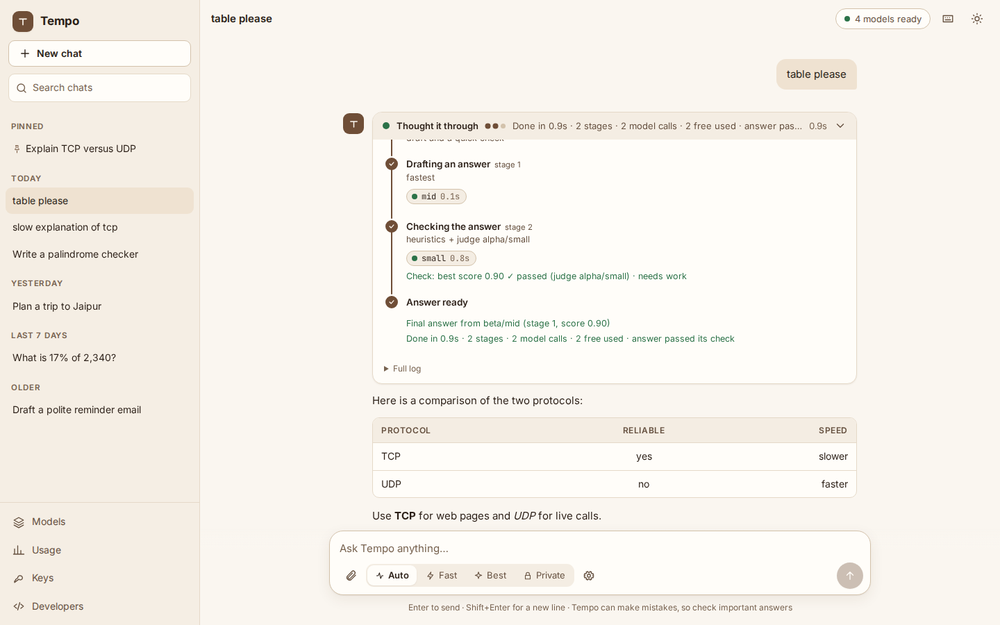

# Tempo-server

**Tempo-server is open models plus the system that runs and trains them.** It routes every question to the best free or open model, checks the answer, fixes it when it is weak, shows every step, and trains its own small open models (Tempo-Router, Tempo-Judge, Tempo-Core) from the answers that passed, all on an ordinary CPU ([plan](docs/TEMPO_MODELS.md); the training kit and its dry run are ready, no real run yet: [docs/TRAINING.md](docs/TRAINING.md)).

Tempo is a **self-routing AI platform**. You ask a question from the web app, the CLI or the API. Tempo works out what kind of question it is and picks the best free or open-source model that is available. It checks the answer, and when the answer is weak it brings in more models to fix it, merge several drafts, or split the job into parts. A small **thinking window** shows every stage live: its job, the model, the reason, the time taken and the free quota left.

Tempo is also meant to be **used by other tools**: it exposes itself as an OpenAI-compatible model (`tempo/auto`), so any OpenAI client can use it by changing the base URL.

> **Status: Phase 2 (Smart) is done.** The staged engine (draft → check → fix → merge/polish, with early stop and budgets), the quota manager, answer checking, cascade, mixture and decompose strategies, the embedding classifier, the semantic cache, measured skill scores, registry sync and health checks, users with their own provider keys, and the usage dashboard all work. Laya runs as the fast decision-maker in shadow mode, and every question is logged for tuning. The learned router, the MCP server and the SDK come next (see the [roadmap](docs/ARCHITECTURE.md#11-roadmap)).
>
> **Software only.** Everything Tempo runs works on an ordinary CPU computer or a free cloud service; nothing needs a GPU. Free notebooks (Kaggle) are used only for offline training jobs, such as fine-tuning Laya ([the rule](docs/ARCHITECTURE.md#1-design-principles)).

## Quick start (under 5 minutes)

Works on Windows, macOS and Linux, on any ordinary computer (no GPU). You never create a Python
environment by hand: Tempo-server installs as its own isolated tool.

### 1. Install (about a minute)

<details open>
<summary><b>macOS and Linux</b></summary>

One line (installs [uv](https://docs.astral.sh/uv/) if needed, then Tempo-server, then runs the
setup):

```bash
curl -LsSf https://raw.githubusercontent.com/narendrachampaneri/Tempo-server/main/install.sh | sh
```

Or with a tool you already have:

```bash
pipx install tempo-server        # or: uv tool install tempo-server
```

</details>

<details>
<summary><b>Windows</b> (PowerShell)</summary>

One line (installs [uv](https://docs.astral.sh/uv/) if needed, then Tempo-server, then runs the
setup):

```powershell
powershell -ExecutionPolicy ByPass -c "irm https://raw.githubusercontent.com/narendrachampaneri/Tempo-server/main/install.ps1 | iex"
```

Or with a tool you already have:

```powershell
pipx install tempo-server        # or: uv tool install tempo-server
```

</details>

<details>
<summary><b>Docker</b> (any system)</summary>

```bash
docker build -t tempo-server https://github.com/narendrachampaneri/Tempo-server.git   # until the image is published
docker run -it --rm -v tempo-data:/data tempo-server setup                   # your keys, in the volume
docker run -d -p 127.0.0.1:8000:8000 -v tempo-data:/data tempo-server        # http://localhost:8000
```

Once published: `ghcr.io/narendrachampaneri/tempo-server`. Set `-e TEMPO_API_KEY=...` before
exposing the port beyond your own computer. Ollama on the host is
`-e OLLAMA_API_BASE=http://host.docker.internal:11434` (Linux: add
`--add-host=host.docker.internal:host-gateway`).

</details>

> **Until the first PyPI release** (0.1.0, coming soon), `pipx install tempo-server` and
> `uv tool install tempo-server` aren't available yet. Install from GitHub with the same tools:
>
> ```bash
> pipx install https://github.com/narendrachampaneri/Tempo-server/archive/refs/heads/main.zip
> uv tool install https://github.com/narendrachampaneri/Tempo-server/archive/refs/heads/main.zip
> ```
>
> The one-line installers already do this.

### 2. Add your free keys (2–3 minutes)

```bash
tempo-server setup
```

The wizard goes through each free provider: where to get the key, its free limits (with their
source), and its terms. Paste a key, or press Enter to skip. Each key is checked with the
provider, stored encrypted, and never shown again. At the end you see how many free requests a
day you now have. One key is enough to start (Groq or Google AI Studio take a minute to create).
If [Ollama](https://ollama.com/download) is running with a model, local models answer simple
questions to save your free quota (the thinking window says so; `TEMPO_LOCAL_FIRST=off` turns it
off), and take over when every free quota is used up. It also offers the code and maths
sandbox (about 16 MB, once), which checks code answers by running their tests and maths answers
by computing the result.

### 3. Start the server

```bash
tempo-server serve            # web app on http://127.0.0.1:8000, API on http://127.0.0.1:8000/v1
```

### 4. Connect an app

Base URL `http://localhost:8000/v1`, model `tempo/auto`, any key (for example `local`) while
it's just you. Step by step for Open WebUI, LibreChat, Continue, Aider, OpenCode, n8n and
LangChain: [docs/CONNECT.md](docs/CONNECT.md).

```bash
tempo-server quota            # free requests left today, per provider
tempo-server ask "Explain the difference between TCP and UDP"
tempo-server doctor           # something wrong? checks everything and says how to fix it
```

No keys yet? `TEMPO_ENABLE_MOCK=1 tempo-server serve` runs offline demo models (one always fails
on purpose, so you can watch the fallback). Or see the [recorded demo](docs/demo/index.html).

**Where your data lives:** `%LOCALAPPDATA%\tempo-server` on Windows,
`~/Library/Application Support/tempo-server` on macOS, `~/.local/share/tempo-server` on Linux
(`TEMPO_DATA_DIR` changes it). An older `~/.tempo` folder is moved there once, automatically.

**Update or remove:** `pipx upgrade tempo-server` / `uv tool upgrade tempo-server`;
`pipx uninstall tempo-server` / `uv tool uninstall tempo-server` (your data folder stays).

**`tempo-server`, not `tempo`:** [Grafana Tempo](https://github.com/grafana/tempo) also installs a
program called `tempo`. The short `tempo` alias still works in 0.x, with a notice, and goes away
before 1.0.

Developing Tempo-server itself (a clone, a virtual environment, editable install, tests):
[CONTRIBUTING.md](CONTRIBUTING.md).

### Providers (all have free tiers)

| Provider | Set | Get it |
|---|---|---|
| Groq | `GROQ_API_KEY` | https://console.groq.com/keys |
| Cerebras (off by default: trial, needs a payment method; `TEMPO_ENABLE_PROVIDERS=cerebras`; never used for eval or collect) | `CEREBRAS_API_KEY` | https://cloud.cerebras.ai |
| Google AI Studio | `GEMINI_API_KEY` | https://aistudio.google.com/apikey |
| OpenRouter (free models) | `OPENROUTER_API_KEY` | https://openrouter.ai/keys |
| Cloudflare Workers AI (10,000 neurons/day) | `CLOUDFLARE_API_TOKEN` + `CLOUDFLARE_ACCOUNT_ID` | https://dash.cloudflare.com/profile/api-tokens |
| Cohere (off by default: each user adds their own trial key; answers only, never judges, never eval or collect) | added per user with `tempo-server keys add cohere` | https://dashboard.cohere.com/api-keys |
| Mistral (free plan; limits read from response headers) | `MISTRAL_API_KEY` | https://console.mistral.ai/api-keys |
| NVIDIA API catalog (off by default; the owner's private testing only, never other users or demo mode; `TEMPO_ENABLE_PROVIDERS=nvidia`) | `NVIDIA_API_KEY` | https://build.nvidia.com |
| OpenCode Zen (off by default, `TEMPO_ENABLE_PROVIDERS=opencode`; free models, each user's own key, answering only) | added per user with `tempo-server keys add opencode` | https://opencode.ai/auth |
| Ollama (local) | `OLLAMA_API_BASE=http://localhost:11434` | https://ollama.com/download |

GitHub Models is not offered: GitHub retired it on 30 July 2026 ([docs](https://docs.github.com/en/github-models), checked 2026-09-28).

Model lists are read live from each provider (public lists without a key: OpenRouter, NVIDIA, OpenCode Zen). Every model gets a type (chat, code, vision, speech-to-text, text-to-speech, safety, embedding, reranker, decision); only chat-capable ones get chat requests. `tempo-server terms` shows each provider's training verdict and what its free tier may do with prompts; `tempo-server terms --check` re-reads the terms pages and reports quotes that changed (NVIDIA's terms are a PDF: install with the `terms` extra, `pipx install "tempo-server[terms]"`).

Installed Ollama models are discovered automatically at startup. The seed model list, skill priors, free limits and each provider's training terms live in [`tempo/models.yaml`](tempo/models.yaml); set `TEMPO_MODELS_FILE` to use your own copy. The server refreshes each provider's model list every 6 hours, and `tempo-server sync` does it on demand.

### Provider terms (may outputs be training data?)

From `tempo-server terms` (quotes re-checked on the providers' pages with `tempo-server terms --check`, 2026-09-28). "Yes" sources are the only ones Tempo exports as training data.

| Provider | Training on outputs | Free tier's use of prompts | Tempo's use |
|---|---|---|---|
| Ollama (local) | by each model's licence: Apache-2.0 / MIT = yes | stays on your computer | default for private and training runs |
| Mistral (free plan) | yes, for text outputs | may train (opt out in the console, then `TEMPO_OPTED_OUT=mistral`) | answering; terms re-read before every export |
| Cloudflare Workers AI | by each model's licence (Cloudflare adds no limit) | not kept, not trained on | answering |
| Groq | unclear (until confirmed in writing) | unknown | answering |
| OpenRouter (free models) | unclear (until confirmed in writing) | treated as may log | answering; `openrouter/free` last |
| Google AI Studio | no | may train | answering |
| Cohere (trial) | no | may train | users' own keys only; answers only, never judges, eval or collect |
| NVIDIA (trial) | no | may train | off; the owner's private testing only |
| OpenCode Zen | no | per model | off; users' own keys, answering only |
| Cerebras (trial) | unclear | unknown | off; never eval or collect |

## Use it from any AI assistant

Tempo-server is also an **MCP server**, so Claude Desktop, Claude Code, Cursor, VS Code and any
other MCP client can call it. It gives them five tools: `ask` (a checked answer), `second_opinion`
(two model families, where they agree and differ), `verify` (a judge from another family checks an
answer), `models` (the free models and their health) and `quota` (free requests left today).

```json
{
  "mcpServers": {
    "tempo-server": { "command": "tempo-server", "args": ["mcp"] }
  }
}
```

That is the Claude Desktop and Cursor format; Claude Code is one command:
`claude mcp add --scope user tempo-server -- tempo-server mcp`. Exact snippets for each app on
Windows, macOS and Linux, and the HTTP option (`tempo-server mcp --http`, which needs your Tempo
key): [docs/MCP.md](docs/MCP.md).

**SDKs** (thin clients over the HTTP API; not published yet, install from `sdk/`):

```python
from tempo_server_client import TempoClient  # pip install ./sdk/python

tempo = TempoClient()  # $TEMPO_URL, $TEMPO_API_KEY
for event in tempo.stream("Explain TCP vs UDP"):
    if event.text:
        print("▸", event.text)  # the thinking window, live
print(tempo.ask("What is 17% of 2,340?").text)
```

```ts
import { TempoClient } from "tempo-server-client";  // npm install ./sdk/js

const tempo = new TempoClient();
for await (const event of tempo.stream("Explain TCP vs UDP")) {
  if (event.text) console.log("▸", event.text);
}
console.log((await tempo.ask("What is 17% of 2,340?")).text);
```

Both cover the thinking-window stream, `ask`, models, quota, consent and feedback
([sdk/python](sdk/python/README.md), [sdk/js](sdk/js/README.md)). Any OpenAI client works too:
[docs/CONNECT.md](docs/CONNECT.md).

## Using Tempo

### Command line

```bash
tempo-server ask "What is 17% of 2,340?"                 # thinking window on stderr, answer on stdout
tempo-server ask --mode best "Prove that √2 is irrational"
tempo-server ask --private "Summarize this" < notes.txt  # local models only
tempo-server ask --no-logging "Summarize this" < notes.txt  # never a free tier that may log or train on prompts
tempo-server ask -s 20 --time-budget 300 "Plan a 5-part course on SQL, with exercises"  # big job
tempo-server ask --strategy mixture "Compare REST and GraphQL for a mobile app"
tempo-server ask --json "hi"                              # one JSON object with answer + trace
tempo-server chat                                         # interactive; /mode fast, /clear, /exit
```

Modes: `auto` (balanced), `fast`, `best` (uses scarce strong models and a higher pass mark), `private` (local only).

Other commands:

| Command | What it does |
|---|---|
| `tempo-server setup [--only groq,gemini]` | The setup wizard: each free provider's key link, limits and terms; checks and stores your keys; shows your free requests a day |
| `tempo-server sandbox install` / `status` / `run FILE` | The WebAssembly sandbox that runs code answers with their tests and computes maths answers (about 16 MB, once; [docs/SANDBOX.md](docs/SANDBOX.md)) |
| `tempo-server mcp [--http --port 8001]` | Run as an MCP server for AI assistants: stdio for desktop apps, or HTTP with a Tempo key ([docs/MCP.md](docs/MCP.md)) |
| `tempo-server doctor [--port N] [--offline]` | Checks Python, the data folder, keys, which providers are reachable, Ollama, Laya (its runner and time per decision, or the exact install command) and the port, with a fix for each problem |
| `tempo-server bench [--modes auto,fast,best] [-n 3] [--repeat 1] [--json]` | Time a few standard questions per mode: seconds to the first token, to the answer being ready, and to every stage done ([docs/SPEED.md](docs/SPEED.md)) |
| `tempo-server quota [--json]` | Free requests left today per provider, and when they reset (also on the web page and `GET /api/quota`) |
| `tempo-server record-demo [--out FILE] [-q QUESTION]` | Record questions for the static demo page ([docs/demo/](docs/demo/index.html)) |
| `tempo-server models` | Which models are ready, and why the others aren't (no key, quota used up, no longer offered, …) |
| `tempo-server sync` | Refresh provider model lists now and report each provider's health |
| `tempo-server models --free [--json]` | Live free-model catalog: provider, model, type, context, max output, inputs, tools, limits, data policy, health, last check and status |
| `tempo-server eval [--model ID] [--task code]` | Measure models on the probe set; the router then blends measured skills into its scores |
| `tempo-server users add NAME` / `list` / `remove` | Create users; each gets a Tempo API key (shown once) |
| `tempo-server users consent NAME [--on\|--off]` / `forget NAME` | A user opts in to (or withdraws from) training use of their questions, off by default; `forget` deletes their logged questions. Also `PUT /api/consent` and `DELETE /api/data` |
| `tempo-server keys add groq [--user NAME]` / `list` / `remove` | Store a provider key, encrypted, after checking it with the provider |
| `tempo-server collect [--yes-only] [--estimate \| --status \| --list]` | Make Laya training data from openly licensed public questions, slowly and within every free limit; resumable. `--yes-only` uses only models whose outputs may be training data (local Apache-2.0/MIT models) |
| `tempo-server export-laya --out DIR [--include-unclear]` | Export logged decisions as a Laya fine-tuning dataset |
| `tempo-server export-sft --out DIR` | Question → checked final answer, for fine-tuning Tempo-Core (only "yes" rows, licence and source on each) |
| `tempo-server export-pairs --out DIR` | Question, chosen (answer that passed) and rejected (draft that failed), for DPO (only "yes" rows) |
| `tempo-server terms` | Whether each provider's outputs may be used for training: verdict, link and exact sentences |
| `tempo-server laya status` / `tempo-server laya compare` | Laya's state per decision; Laya vs rules on held-out questions |

### Web app

`tempo-server serve`, then open http://127.0.0.1:8000.

- **Ask:** the first good answer is shown as soon as its model finishes, and checking goes on in the background; if a check finds a real problem, the fix replaces it and the page shows what changed. A warm white-and-brown chat (and a dark brown theme that follows your system) with an animated **thinking timeline**: each stage lights up as it runs and every model appears as it is called. Streaming answers with Stop, regenerate, edit and resend, copy, Markdown with tables, maths and highlighted code, sandboxed HTML/SVG/Mermaid previews with download, file and image attachments (drag, drop, paste), voice input and read-aloud when a Groq key allows it, modes (Auto, Fast, Best, Private), a model picker and stage/time settings, keyboard shortcuts (`?` shows them) and friendly errors with the next step. A 👍/👎 under each answer is saved for tuning, and a strip shows the free requests left today per provider.
- **History:** past chats in the sidebar (Today, Yesterday, Last 7 days, Older), with search, rename, pin, delete and export as Markdown or JSON. Opening one shows it exactly as it was, thinking timeline included, and you can continue it. Chats stay on your computer, in the data folder, and saving them is not consent to train. **Private** mode uses local models only and saves nothing.
- **Models:** providers and models, ready or not and why, with measured skill scores and health.
- **Usage:** questions, pass rate, median and p95 time, average stages, free requests used, feedback, the models used, why questions stopped, free quota left today, and how often Laya agrees with the rules. Users see only their own questions.
- **Keys:** add your own provider keys (bring your own key). A key is checked with the provider before it is saved, stored encrypted, and never sent back to the page.
- **Developers:** copy-paste snippets for the API.

Everything the page needs (fonts, KaTeX, Mermaid) is bundled, so it works offline. More in [docs/WEB_UI.md](docs/WEB_UI.md), with screenshots for phone, tablet and desktop in both themes in [docs/screenshots](docs/screenshots).



### OpenAI-compatible API

```python
from openai import OpenAI

client = OpenAI(base_url="http://127.0.0.1:8000/v1", api_key="unused")
reply = client.chat.completions.create(
    model="tempo/auto",  # or tempo/fast, tempo/best, tempo/private, or a model id from `tempo-server models`
    messages=[{"role": "user", "content": "Explain recursion in one paragraph."}],
    extra_body={"tempo": {"allow_providers": ["groq", "cerebras"], "max_stages": 3, "trace": True}},
)
print(reply.model)  # the model that wrote the final answer
print(reply.choices[0].message.content)
print(reply.tempo["trace"])  # thinking-window events
```

- **Conditions** go in the `tempo` field: `mode`, `privacy` (`"local_only"`, or `"no_logging"`: never a model whose free tier may log or train on prompts), `allow_providers`, `trace`, `max_stages` (1–50), `time_budget_s`, `quota_budget`, `max_parallel`, `strategy` (`single`, `cascade`, `mixture`, `decompose`).
- **Tool calling** (`tools`, `tool_choice`, `parallel_tool_calls`) works the same on every provider: models with native tool support get the tools as is; every other model gets them described in its prompt, and replies in the text formats open models print (Hermes/Qwen `<tool_call>`, Mistral `[TOOL_CALLS]`, Llama `<|python_tag|>` and `<function=…>`, JSON) become normal OpenAI `tool_calls`. Every call is validated (known function, arguments matching its JSON schema, `tool_choice` honoured); a bad reply is retried on another model. Send tool results back as `role: "tool"` messages as usual.
- **Strict JSON** (`response_format` `json_schema` or `json_object`): passed natively to models that support structured outputs (a provider that rejects it is remembered and never sent it again), and every answer is validated against the schema and retried on another model when it doesn't match; you get clean JSON.
- **Errors**: `502` with the reason when models answered but none gave a valid tool call or JSON; `503` with a `Retry-After` header (a minute, or the next daily reset) when no model is available or the free quota is used up.
- **Text answers after tool results** get the quick checks (empty, refusal, wrong language); the judge and fix stages run only in `best` mode or when a quick check fails (`TEMPO_TOOL_FOLLOWUP=quick|full|off`).
- **Images** (`image_url` parts): sent only to vision models, at every stage.
- **Streaming** works (`stream=True`), for all of the above; tool calls stream as OpenAI `tool_calls` deltas, and tool-call and JSON answers are streamed after they are validated. OpenAI clients can't take back text, so a multi-stage question streams the checked final answer. With `max_stages: 1` it streams live from the model. Trace events arrive as chunks with empty `choices`, and model reasoning arrives as `delta.reasoning_content`.
- `POST /api/ask` streams every engine event as server-sent events, including live drafts and `answer_reset` when a later stage replaces a draft. The web app uses it. `POST /api/feedback` records 👍/👎, and `GET /api/usage?hours=24` returns the dashboard numbers.
- **Auth:** with no users and no `TEMPO_API_KEY`, the server is open (local mode). Once a user exists, every `/v1/*` and `/api/*` request needs `Authorization: Bearer <their Tempo key>` (the web app asks for it). `TEMPO_API_KEY` is an admin key that sees everything.

## How it works

```
question ─▶ understand ─▶ plan ─▶ draft ─▶ check ─┬─ passes ─▶ final answer
            (rules,        (strategy,  (1 model, or  │
             embeddings,    stage       2-3 from      └─ fails ─▶ fix / merge / polish ─▶ check …
             Laya)          budget)     different                 (until it passes or a budget runs out)
                                        families)
```

1. **Understand** ([`analyzer.py`](tempo/analyzer.py), [`embeddings.py`](tempo/embeddings.py)): task, complexity, script, needs and token estimates. Keyword rules come first; an embedding kNN vote overrides them only when the rules aren't sure. Near-identical recent questions are answered from the semantic cache.
2. **Plan and rank** ([`router.py`](tempo/router.py), [`quota.py`](tempo/quota.py), [`evals.py`](tempo/evals.py)): drop models that can't take the request (no key, not installed, cooling down, free quota used up, no longer offered, context too small, not local in private mode). Score the rest by predicted quality (priors blended with measured and live judge scores), quota scarcity and measured speed ([`speed.py`](tempo/speed.py): time to first token and tokens a second, a rolling record per model), weighted by mode. Plan the stages that fit the time budget, and skip any model that can't finish in the time left. Pick a strategy: single, cascade, mixture or decompose.
3. **Run stages** ([`pipeline.py`](tempo/pipeline.py)): draft, check ([`checks.py`](tempo/checks.py): heuristics, plus a judge from a different model family), then fix, merge or polish until the answer passes. The first good answer is shown as soon as its model finishes; the checks go on in the background and replace it only when they find a real problem. Stop at the first pass, or when the stage, time or free-quota budget runs out: a budget stops new stages, never an answer that is arriving, and an answer cut at a model's output limit is continued. Calls go through [LiteLLM](https://github.com/BerriAI/litellm) with automatic fallback; a rate limit or error cools that model down and moves to the next one.
4. **Decide fast with Laya** ([`laya_decider.py`](tempo/laya_decider.py)): before stage 1, Laya predicts the task type, difficulty, strategy and stage budget. After each check it scores the answer and says stop or continue, and before each stage it picks a model from a shortlist of at most 10. It starts in **shadow mode**: Laya predicts, the rules decide, and both are logged. If Laya is missing, errors, or takes longer than 200 ms, the rules decide.
5. **Show and log everything** ([`events.py`](tempo/events.py), [`store.py`](tempo/store.py)): every step is an event with a one-line summary, rendered the same way by the web app, CLI and API. Every question is logged to SQLite (`tempo.db in the data folder`): decisions with Laya's predictions and probabilities, stages, calls, check results, times, quota used, the final answer and feedback.

The full design, with the stage jobs, events and Laya details, is in [docs/ARCHITECTURE.md §4.11–4.12](docs/ARCHITECTURE.md#411-the-staged-engine-built-in-phase-2).

### Laya on CPU, and tuning it on your own decisions

Laya runs on an ordinary CPU. In shadow mode (the default) Tempo asks it in the background, so it adds no time to an answer; only decisions you hand to Laya are waited for, within a time limit Tempo measures on your machine when Laya loads. Measured on a 4-core CPU: shadow mode costs nothing, and a taken-over decision costs about 0.4–0.8 s per stage ([docs/LAYA_CPU.md](docs/LAYA_CPU.md), which also explains why INT8 is not the default).

The stock checkpoints are near chance on Tempo's decisions, so fine-tune one first. The full walk-through is in [docs/LAYA_TUNING.md](docs/LAYA_TUNING.md):

```bash
tempo-server collect --estimate                      # how long, at your keys' free limits
tempo-server collect                                 # public, openly licensed questions; stop and resume any time
tempo-server export-laya --out laya-dataset          # train.jsonl + test.jsonl + README (licences listed)
# fine-tune with Laya's notebook on Kaggle's free GPUs (offline; the only GPU step)
export TEMPO_LAYA_MODEL=/path/to/checkpoint   # the tuned checkpoint, on CPU, still in shadow mode
tempo-server laya compare                            # after a few hundred more questions
export TEMPO_LAYA_TAKEOVER="should_stop=auto, next_model=auto"   # Laya takes over where it wins
```

The same loop trains Tempo-Core too, with two ready Kaggle notebooks and three commands; [docs/TRAINING.md](docs/TRAINING.md) has every step:

```bash
tempo-server train dry-run                 # the whole loop on your CPU with tiny models, no keys (needs [train])
tempo-server train prepare                 # exports, licence and data-mix checks, one zip for Kaggle, upload steps
tempo-server models import ~/Downloads/output.zip   # after the notebook ran on Kaggle
tempo-server models compare                # held-out questions, old vs new, the gate per task type
tempo-server models promote                # the new version takes the task types it won
```

The labels come from outcomes: how many stages an answer really needed, judge scores, 👍/👎, and whether later stages improved the answer. A row is exported only if every model that answered or judged its question belongs to a provider marked `training_on_outputs: yes`; `--include-unclear` adds `unclear` ones after you have read their terms (`tempo-server terms`), and `no` is never exported.

## Settings

All optional; put them in `.env` or the environment. `tempo-server setup` writes the non-secret ones it
needs (for example `CLOUDFLARE_ACCOUNT_ID`, `OLLAMA_API_BASE`, `TEMPO_ENABLE_PROVIDERS`) to
`<data dir>/settings.env`; the environment and `.env` win over it. Keys never go there.

| Variable | Default | Meaning |
|---|---|---|
| `TEMPO_DATA_DIR` | the system's app-data folder | Where the SQLite log, quota counters, users and the key-vault secret live: `%LOCALAPPDATA%\tempo-server`, `~/Library/Application Support/tempo-server` or `~/.local/share/tempo-server` (`memory` keeps nothing) |
| `TEMPO_LOG` | `1` | Log every question for tuning |
| `TEMPO_MAX_STAGES` | `5` | Most stages per question (up to 50) |
| `TEMPO_TIME_BUDGET` | `60` | Seconds per question: no new stage starts after it, and stages are planned to fit it ([docs/SPEED.md](docs/SPEED.md)) |
| `TEMPO_FINISH_GRACE` | `120` | Extra seconds an answer already arriving may take to finish after the time budget (answers are never cut short) |
| `TEMPO_QUOTA_BUDGET` | `12` | Free provider requests per question (local models are free) |
| `TEMPO_MAX_PARALLEL` | `3` | Models per parallel stage |
| `TEMPO_JUDGE` | `1` | Use a judge model in the check stage |
| `TEMPO_LAYA` | `auto` | `auto` (load if installed), `on` (also for one-shot CLI runs), `off` |
| `TEMPO_LAYA_MODEL` | stock checkpoints | A fine-tuned Laya checkpoint (folder or Hub repo) for every decision |
| `TEMPO_LAYA_TAKEOVER` | all `shadow` | Per decision: `shadow`, `laya` or `auto`, e.g. `should_stop=auto, task_type=laya` or `all=auto` |
| `TEMPO_LAYA_TIMEOUT_MS` | `auto` | How long an answer waits for a taken-over decision; `auto` measures it on this machine at load |
| `TEMPO_LAYA_MIN_CONFIDENCE` | `0.6` | Below this, the rules decide even after a takeover |
| `TEMPO_LAYA_BACKEND` | `auto` | `auto` (times PyTorch and ONNX Runtime fp32 once on this machine and keeps the faster; same answers), `torch`, `onnx`, or `onnx-int8` (faster, but changes answers) |
| `TEMPO_LAYA_SKIP_SURE` | `1` | Don't ask Laya when the rules are sure (`0` asks it every time) |
| `TEMPO_LAYA_CHECKPOINT` | `english` | Stock checkpoint: `english` or `multilingual` (2.6× faster, a different model) |
| `TEMPO_LAYA_THREADS` | up to 4 | CPU threads for Laya |
| `TEMPO_EMBEDDINGS` | `auto` | `off` uses keyword rules only (and turns off the semantic cache) |
| `TEMPO_EMBEDDING_MODEL` | `BAAI/bge-small-en-v1.5` | Any fastembed model |
| `TEMPO_CACHE` / `TEMPO_CACHE_TTL` | `1` / `86400` | Semantic cache on/off and max age in seconds |
| `TEMPO_SECRET_KEY` | generated | Key-vault secret (otherwise a 0600 `secret.key` file in the data dir) |
| `TEMPO_SYNC_INTERVAL` | `21600` | Seconds between registry syncs (`0` = off) |
| `TEMPO_API_KEY` | none | Admin key for the API and web app |
| `TEMPO_CORS_ORIGINS` | none | Websites whose pages may call the API from a browser, each written exactly (`https://app.example.com,http://localhost:5173`); no wildcard, no path |
| `TEMPO_SANDBOX` / `TEMPO_SANDBOX_MATH` | `auto` / `auto` | Run code answers with their tests, and compute maths answers, in a WebAssembly sandbox when installed (`off` to stop); maths: `rules` never asks a model for a program ([docs/SANDBOX.md](docs/SANDBOX.md)) |
| `TEMPO_SANDBOX_TIMEOUT` / `TEMPO_SANDBOX_MEMORY_MB` / `TEMPO_SANDBOX_OUTPUT_KB` | `10` / `256` / `64` | Limits per sandbox run |
| `TEMPO_TRAIN_ON_MCP` | `0` | Questions from AI assistants over MCP are logged apart (tagged `mcp`) and kept out of every training export; `1` includes them (assistants often send private code or documents) |
| `TEMPO_SHARE_SERVER_KEYS` | `0` | Keys in `.env`/the environment are the owner's; `1` lets every user of this server use them too (keys from `tempo-server setup` are always the owner's only) |
| `TEMPO_LOCAL_FIRST` / `TEMPO_LOCAL_FIRST_MAX_COMPLEXITY` | `auto` / `0.3` | Send simple questions (up to this complexity) to a running local Ollama model first, to save free quota; `off` to turn off. Never in `best` mode |
| `TEMPO_TOOL_FOLLOWUP` | `quick` | Checks for text answers to tool-calling requests: `quick`, `full` (always judge) or `off` |
| `TEMPO_MIN_PUBLIC_SHARE` / `TEMPO_MAX_SELF_SHARE` | `0.3` / `0.3` | Training data mix: at least this share from public or human data, at most this share written by an earlier Tempo-Core (exports warn) |
| `TEMPO_ENABLE_PROVIDERS` / `TEMPO_OPTED_OUT` | none | Providers that are off by default to turn on (e.g. `nvidia`); providers whose "train on my data" setting you turned off (e.g. `mistral`) |
| `TEMPO_REQUEST_TIMEOUT` / `TEMPO_MAX_ATTEMPTS` | `60` / `4` | Per-call timeout and fallback attempts |

## Optional extras

Install with an extra when you want it (`uv tool install "tempo-server[embeddings]"` works the
same way):

| Extra | What it adds |
|---|---|
| `pipx install "tempo-server[embeddings]"` | Embedding task classifier and semantic cache (fastembed, ~65 MB model, CPU) |
| `pipx install "tempo-server[laya]"` | Laya decision-maker on CPU (PyTorch and ONNX Runtime) |
| `pipx install "tempo-server[terms]"` | `tempo-server terms --check` for NVIDIA's PDF terms |
| `pip install "tempo-server[train]"` | Training libraries for `tempo-server train dry-run` (PyTorch, Transformers, PEFT, TRL, Laya); the real training runs on Kaggle ([docs/TRAINING.md](docs/TRAINING.md)) |

## Development

A clone, a virtual environment and an editable install are for working on Tempo-server itself:
see [CONTRIBUTING.md](CONTRIBUTING.md).

## Documents

- [CLAUDE.md](CLAUDE.md): the owner's rules every working session follows (software only, free only, live model lists, keys, provider terms, training data).
- [docs/STATUS.md](docs/STATUS.md): what is done, in progress, blocked and next, and what to run once provider keys exist.
- [docs/SPEED.md](docs/SPEED.md): fast answers within the time budget: measured speed, planning, never cutting an answer, `tempo-server bench`, and before/after numbers with fake providers.
- [docs/SANDBOX.md](docs/SANDBOX.md): how code and maths answers are checked by running them in WebAssembly, and the sandbox's limits.
- [docs/MCP.md](docs/MCP.md): Tempo-server as an MCP server for Claude Desktop, Claude Code, Cursor and VS Code; the tools.
- [sdk/python](sdk/python/README.md) and [sdk/js](sdk/js/README.md): the Python and JavaScript/TypeScript SDKs.
- [docs/CONNECT.md](docs/CONNECT.md): connect Open WebUI, LibreChat, Continue, Aider, OpenCode, n8n or LangChain.
- [docs/demo/](docs/demo/index.html): a recorded session replayed in the browser (static, for GitHub Pages).
- [docs/TRAINING.md](docs/TRAINING.md): the training path step by step: collect, prepare, Kaggle, import, compare, promote; the dry run.
- [docs/TEMPO_MODELS.md](docs/TEMPO_MODELS.md): Tempo's own open models (Tempo-Router, Tempo-Judge, Tempo-Core, Tempo Tune add-ons): data, training plan, promotion gate, collapse protection, release.
- [docs/USE_CASES.md](docs/USE_CASES.md): 20 scenarios Tempo is for, what each still needs, and its roadmap phase.
- [docs/PUBLISHING.md](docs/PUBLISHING.md): licence options, keys, the demo, and the checklist before going public. See also [CONTRIBUTING.md](CONTRIBUTING.md), [SECURITY.md](SECURITY.md) and [examples/](examples/).
- [docs/COLLECT_ANYWHERE.md](docs/COLLECT_ANYWHERE.md): step-by-step `tempo-server collect` on a Windows computer (local open-licence models), and as a scheduled GitHub Actions job that resumes across runs.
- [docs/RESEARCH.md](docs/RESEARCH.md): existing GitHub projects (routers, gateways, model-mixing methods), the free LLM API providers and their limits, and what to avoid.
- [docs/ARCHITECTURE.md](docs/ARCHITECTURE.md): the full design: components, request lifecycle, the staged engine, Laya, thinking-window events, the neural router, using Tempo as a skill (API / MCP / CLI), security, tech stack, the roadmap and the planned **Tempo Tune** phase.

## Licence

Apache-2.0 ([LICENSE](LICENSE), [NOTICE](NOTICE)). Copyright 2026 The Tempo-server authors. Models inherit their base model's licence, and their model cards credit the datasets they were trained on.
