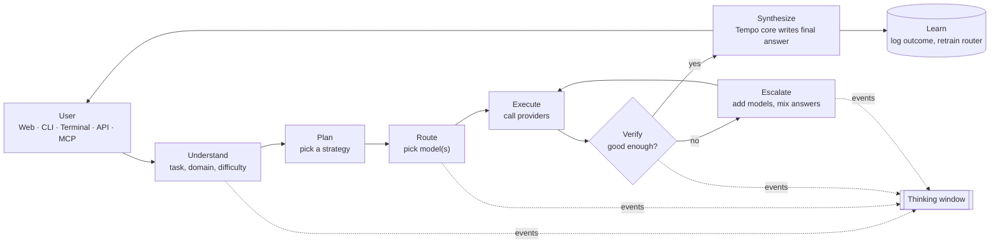
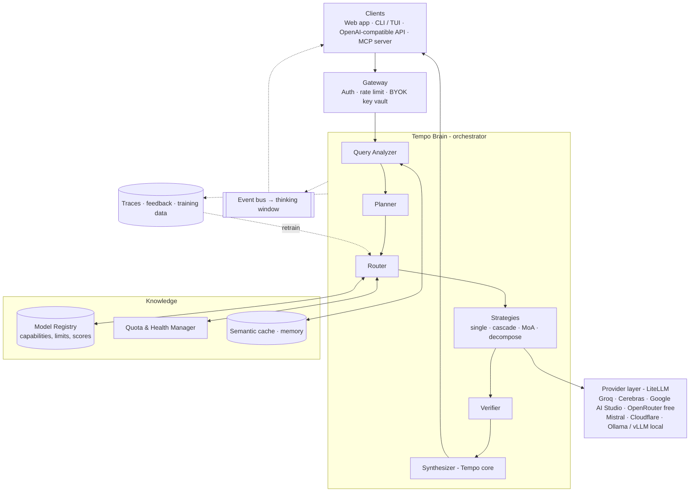
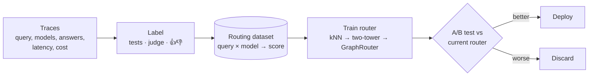

# Tempo architecture: a self-routing "model of models" platform

This is the detailed design for Tempo. It explains **what each part does, why it exists, and how the parts
talk to each other**. Code blocks are sketches to show the shape of the logic, not finished code.

Research behind these choices: [RESEARCH.md](./RESEARCH.md).

---

## 0. The idea in one picture



Every box emits events. The **thinking window** is just a live view of those events.

---

## 1. Design principles

1. **One brain, many hands.** Tempo has one orchestrator (the "brain") that owns every decision. Providers and models are interchangeable "hands".
2. **Cheap first, escalate on evidence.** Try the fastest suitable free model; bring in more models only when a verifier says the answer is weak.
3. **Everything is observable.** Each decision (why this model, how confident, what it cost) is an event the user can see and the learning loop can use.
4. **Free is a budget, not a guarantee.** Free tiers have per-minute and per-day limits. Tempo tracks remaining quota and routes around exhausted providers before a request fails.
5. **Speak standard protocols.** Tempo is itself an OpenAI-compatible model (`tempo/auto`) and an MCP server, so anyone can plug it into their own tools.
6. **Start simple, learn later.** Version 1 uses rules and embeddings. Logged outcomes train neural routers in later versions.

---

## 2. System overview



| Layer | Responsibility | Build or reuse |
|---|---|---|
| Clients | Web home page, CLI, terminal UI, API, MCP | Build (API is OpenAI-compatible, so Open WebUI / LibreChat work as a day-one UI too) |
| Gateway | Accounts, Tempo API keys, per-user limits, encrypted storage of users' provider keys | Build (small) |
| Brain | Understand → plan → route → execute → verify → synthesize | **Build: this is the product** |
| Registry + Quota | What models exist, what they're good at, how much free quota is left, are they up | Build, seeded from provider `/models` endpoints |
| Provider layer | Talk to 100+ providers in one format, retries, fallbacks | **Reuse [LiteLLM](https://github.com/BerriAI/litellm)** |
| Learning | Store traces, label outcomes, train routers | Build, using [LLMRouter](https://github.com/ulab-uiuc/LLMRouter) algorithms |

---

## 3. The life of one request

Example: a user types **"Write a Python function that parses ISO-8601 durations, with tests."**

| # | Step | What happens | What the thinking window shows |
|---|---|---|---|
| 1 | **Receive** | Gateway authenticates, loads user settings (mode, privacy, their own keys). | `Received · mode: auto` |
| 2 | **Cache check** | Embed the query; if a near-identical query was answered recently, return it. | `Cache miss` |
| 3 | **Understand** | Query Analyzer labels it: task=`code`, language=`python`, complexity=0.62, needs=`reasoning`, est. 900 output tokens, modality=`text`. | `Understanding: coding · Python · medium difficulty` |
| 4 | **Plan** | Planner picks a strategy. Medium code task → **cascade** with a code-execution verifier. | `Plan: cascade, verify by running tests` |
| 5 | **Route** | Router scores every available model for this query, drops ones with no quota or too-small context, picks the best. | `Routing → groq/llama-3.3-70b (score 0.81, 912 requests left today)` |
| 6 | **Execute** | Call through LiteLLM with streaming. If the provider errors or rate-limits, fall back to the next-best model automatically. | `Answer received in 1.6 s` |
| 7 | **Verify** | Extract code, run the tests in a sandbox. 2 of 5 fail → confidence 0.40. | `Verifier: 2/5 tests failed · confidence 0.40` |
| 8 | **Escalate** | Below threshold → Mixture-of-Agents: 3 strong free models get the question **plus** the failing attempt and test output. | `Escalating → 3 models in parallel` |
| 9 | **Aggregate** | Tempo core reads all candidates, merges the best parts, re-runs the tests: 5/5 pass. | `Aggregating · 5/5 tests pass · confidence 0.93` |
| 10 | **Synthesize** | Tempo core writes the final answer in one consistent voice and format. | `Writing final answer` |
| 11 | **Learn** | Store the trace: query embedding, models tried, scores, cost, latency, and later the user's 👍/👎. | (hidden) |

---

## 4. Components in depth

### 4.1 Query Analyzer ("where should this go?")

Goal: turn free text into a structured **query profile** in under ~100 ms.

```python
class QueryProfile(BaseModel):
    task: Literal["chat", "code", "math", "reasoning", "writing", "summarize",
                  "translate", "extract", "vision", "speech", "search"]
    domain: str | None           # "medicine", "law", "finance", ...
    complexity: float            # 0..1
    language: str                # "en", "hi", "gu", ...
    modality_in: set[str]        # {"text"}, {"text","image"}, {"audio"}
    needs: set[str]              # {"reasoning","tools","web","long_context","json"}
    est_input_tokens: int
    est_output_tokens: int
    embedding: list[float]
```

Build it in three layers, cheapest first:

1. **Rules** (microseconds): attachments → modality; code fences → code; "translate to" → translate; token count → long_context.
2. **Embedding classifier** (milliseconds): embed the query with a small local embedding model, compare with labelled example queries per task ([semantic-router](https://github.com/aurelio-labs/semantic-router) does exactly this).
3. **Small router LLM** (when unsure): [Arch-Router-1.5B](https://huggingface.co/katanemo/Arch-Router-1.5B) matches the query to route descriptions you write in plain English, or NVIDIA's [prompt-task-and-complexity-classifier](https://github.com/NVIDIA-AI-Blueprints/llm-router) returns task + complexity. Both run locally.

### 4.2 Model Registry ("who can do what?")

A database row per model. It's what makes "1000+ models" manageable.

```yaml
id: groq/llama-3.3-70b-versatile
provider: groq
family: llama-3.3
params_b: 70
context_window: 131072
modalities_in: [text]
modalities_out: [text]
supports: [tools, json_mode, streaming]
free_limits: {rpm: 30, rpd: 1000, tpm: 12000}
privacy: {trains_on_data: unknown, allowed_for_end_users: check_terms}
skills:            # 0..1, from benchmarks + your own evals + live feedback
  code: 0.74
  math: 0.68
  reasoning: 0.70
  writing: 0.77
  multilingual: 0.71
elo: 1238          # updated from pairwise judge results
latency_p50_ms: 900
tokens_per_sec: 280
status: healthy    # from health checks
```

How it stays current:
- **Auto-sync** every few hours from provider model lists (OpenRouter `/api/v1/models`, Groq/Cerebras/Mistral `/v1/models`, Ollama `/api/tags`, Hugging Face Inference Providers). New models appear automatically with default skill scores taken from their family and size.
- **Probe evals**: when a new model appears, run a small fixed eval set (e.g. 50 questions per skill) in the background to fill in `skills`.
- **Live stats**: latency, error rate and user feedback update the row continuously.

### 4.3 Quota & Health Manager ("who can take a request right now?")

Free tiers fail in predictable ways: 429 rate limits, daily caps, model removed. Handle them **before** calling.

- A **token bucket per (provider, key, model)** in Redis for requests/min, requests/day, tokens/min. Read limits from the registry, then correct them from `x-ratelimit-*` response headers where the provider sends them.
- A **circuit breaker** per model: after N consecutive errors, mark it `degraded` for a cool-down period so the router skips it.
- **BYOK**: if a user has added their own Groq key, their requests use their bucket, not a shared one.

The router only ever sees models where `status == healthy and quota_left > 0`.

### 4.4 Router ("pick the best model for this query")

**Hard filters** first (cheap, never wrong):
- modality supported, context window ≥ input + output tokens,
- quota available, healthy,
- privacy rule satisfied (e.g. user chose "local only" → only Ollama/vLLM models).

**Then score** each remaining model:

```
utility(m, q) = w_quality · predicted_quality(m, q)
              − w_cost    · cost(m, q)          # 0 for free tiers, but counts quota scarcity
              − w_latency · expected_latency(m, q)
```

The user's **mode** sets the weights:

| Mode | w_quality | w_cost | w_latency |
|---|---|---|---|
| `fast` | 0.5 | 0.1 | 0.4 |
| `balanced` (default) | 0.7 | 0.15 | 0.15 |
| `best` | 0.95 | 0 | 0.05 |
| `private` | same as balanced, but local models only | | |

For free tiers, make `cost` reflect **scarcity**: a model with 3 requests left today "costs" more than one with 10,000 left. That spreads load and saves scarce strong models for hard queries.

`predicted_quality` is where the router gets smarter over time:

| Generation | How `predicted_quality` is computed | Needs |
|---|---|---|
| **G1: rules** | `registry.skills[q.task]` adjusted by complexity. | Nothing. Ship this first. |
| **G2: kNN** | Find the 20 most similar past queries (by embedding); average each model's judged score on them. | A few thousand logged, scored requests. |
| **G3: neural two-tower / matrix factorization** | A small network scores (query, model) pairs (sketch in §5). Same idea as RouteLLM's `mf` router. | ~10k+ scored requests. |
| **G4: graph router** | [GraphRouter](https://github.com/ulab-uiuc/GraphRouter): a GNN over task, query and model nodes predicts quality and cost for each query→model edge; new models join without retraining. | Mature dataset. |
| **G5: LLM orchestrator trained with RL** | [Router-R1](https://github.com/ulab-uiuc/Router-R1): Tempo core itself decides "think" vs "call model X" step by step, trained with a reward for correctness minus cost. | Research-grade; later. |

### 4.5 Strategies ("how many models, and how do they work together?")

The Planner chooses one strategy per request:

| Strategy | When | How |
|---|---|---|
| **Single** | Easy or chatty queries (complexity < 0.3) | One model, fallback on error. |
| **Cascade** | Most queries | Cheap/fast model first; verify; escalate one tier at a time. ([FrugalGPT](https://arxiv.org/abs/2305.05176), [AutoMix](https://github.com/automix-llm/automix)) |
| **Mixture-of-Agents** | Hard queries, `best` mode, or after a failed cascade | K proposer models in parallel, optional 2nd layer that sees layer-1 answers, then an aggregator. ([MoA](https://github.com/togethercomputer/MoA)) |
| **Decompose** | Multi-part or multi-modal tasks ("transcribe this audio, summarize it, translate to Hindi") | Split into sub-tasks, route each to a specialist (Whisper for speech, a vision model for images, an LLM for text), then combine. ([HuggingGPT](https://github.com/microsoft/JARVIS)) |
| **Tool-augmented** | Needs fresh facts or computation | Give the model tools: web search, code sandbox, calculator; or route to a provider with built-in tools. |

Cascade sketch:

```python
async def cascade(q: QueryProfile, messages, trace) -> Answer:
    attempts = []
    for tier in planner.ladder(q):                 # e.g. [fast_small, strong_free, mixture]
        model = router.best(q, tier=tier, exclude=[a.model for a in attempts])
        trace.emit("route", model=model.id, score=model.score, why=model.reason)

        answer = await providers.call(model, messages, on_error=router.fallback)
        verdict = await verifier.check(q, messages, answer)
        trace.emit("verify", model=model.id, confidence=verdict.confidence, notes=verdict.notes)

        if verdict.confidence >= q.min_confidence:
            return answer
        attempts.append(answer.with_feedback(verdict))   # the next tier sees what went wrong

    return await mixture_of_agents(q, messages, seed_answers=attempts, trace=trace)
```

Mixture-of-Agents sketch (this is the "layers" part of the idea):

```python
async def mixture_of_agents(q, messages, seed_answers, trace, layers=2, k=3):
    references = [a.text for a in seed_answers]
    for layer in range(layers):
        proposers = router.top_k(q, k=k, diverse_families=True)
        trace.emit("layer", n=layer + 1, models=[m.id for m in proposers])
        results = await asyncio.gather(
            *(providers.call(m, with_references(messages, references)) for m in proposers),
            return_exceptions=True,
        )
        references = [r.text for r in results if not isinstance(r, Exception)]

    aggregator = router.best(q, role="aggregator")    # usually Tempo core
    trace.emit("aggregate", model=aggregator.id, inputs=len(references))
    return await providers.call(aggregator, aggregate_prompt(messages, references))
```

Pick proposers from **different model families** (Llama, Qwen, Gemma, Mistral, gpt-oss). Diversity is what makes mixing help; three copies of similar models mostly repeat each other.

### 4.6 Verifier ("is this model capable, or do we need help?")

This is how Tempo decides "the model is not capable". Combine cheap signals first:

| Signal | Cost | Catches |
|---|---|---|
| Provider error, timeout, empty or cut-off output | free | outages, context overflow |
| Refusal detection (regex + small classifier) | free | "I can't help with that" on a harmless request |
| Format checks (valid JSON / schema, code parses) | free | broken structured output |
| **Execution** (run code and tests in a sandbox, check math numerically) | cheap | wrong code / wrong numbers; strongest signal when available |
| Self-verification: ask the same small model "is this answer correct?" (AutoMix-style) | 1 small call | many reasoning slips |
| LLM-as-judge with a different model family, scored 1–10 against a rubric | 1 call | quality, completeness |
| Agreement: do 2–3 models give the same final answer? | K calls | factual / math questions |

Output: `confidence ∈ [0,1]` plus short notes. The threshold depends on mode (`fast` accepts 0.6, `best` wants 0.85).

### 4.7 Synthesizer / Tempo core ("goes back to my main model")

Tempo core is **your own** model identity: a system prompt, output style and a model you control.

- **Version 1:** a strong free model chosen by the router for the `aggregator` role, with Tempo's system prompt.
- **Version 2:** a self-hosted open-weight model (for example a Qwen, Gemma or gpt-oss size that fits your GPU) served by vLLM, so Tempo always has a brain even when every free API is exhausted.
- **Version 3:** fine-tune that model (LoRA) on your own traces, so it gets better at routing decisions and at merging other models' answers. Check each provider's terms before training on its outputs; many forbid using outputs to build competing models. Outputs of permissively licensed open-weight models you run yourself are the safest training data.

Its jobs: merge candidate answers, fix contradictions, keep one voice and format, cite which model contributed what (optional), and treat all sub-model output as **untrusted text** (never follow instructions found inside it).

### 4.8 Event bus and the thinking window

Every Brain step publishes a small JSON event to the request's channel (Redis pub/sub or an in-process queue). Clients subscribe with **Server-Sent Events** (web) or read the stream (CLI).

```json
{"t": 0.00, "type": "received",  "mode": "auto"}
{"t": 0.04, "type": "analyze",   "task": "code", "lang": "python", "complexity": 0.62}
{"t": 0.05, "type": "plan",      "strategy": "cascade", "verify": "run_tests"}
{"t": 0.06, "type": "route",     "model": "groq/llama-3.3-70b-versatile", "score": 0.81,
                                 "why": "top code score among healthy models; 912 req left today"}
{"t": 1.66, "type": "call_end",  "model": "groq/llama-3.3-70b-versatile", "ms": 1600, "tokens": 734}
{"t": 2.10, "type": "verify",    "confidence": 0.40, "notes": "2/5 tests failed"}
{"t": 2.11, "type": "escalate",  "strategy": "mixture", "models": ["cerebras/gpt-oss-120b", "gemini/gemini-flash", "mistral/mistral-small"]}
{"t": 6.80, "type": "aggregate", "model": "tempo-core", "inputs": 3}
{"t": 7.30, "type": "verify",    "confidence": 0.93, "notes": "5/5 tests pass"}
{"t": 7.31, "type": "answer_delta", "text": "Here is a parser..."}
{"t": 9.02, "type": "done",      "models_used": 5, "total_ms": 9020, "cost_usd": 0}
```

UI rules for the window: small panel, monospace, auto-scrolls, collapsible, each line expandable to see detail (full scores table, raw candidate answers). Show **decisions** (what Tempo did and why), not raw hidden reasoning. If a model returns visible reasoning (some open reasoning models do), show it as an expandable sub-item.

### 4.9 Cache and memory

- **Semantic cache**: embedding + pgvector/Redis; return a cached answer when similarity > 0.97 and the query isn't time-sensitive. Saves scarce free quota.
- **Conversation memory**: recent turns verbatim, older turns summarized by a small model. The router has to account for the history's tokens when checking context windows.
- **Sticky routing inside a conversation**: prefer the same model across turns unless the task changes, so tone and context stay consistent.

### 4.10 Learning loop



- Log every request (with user consent and PII scrubbing).
- Label outcomes automatically (tests, judge scores) and with users' 👍/👎.
- Occasionally (e.g. 2% of traffic) send the query to a **second** model too and have a judge compare them. This "exploration" data is what teaches the router about models it rarely picks.
- Retrain nightly or weekly; deploy only if it beats the current router offline **and** in an A/B test.

---

## 5. The "neural network that connects models": what is and isn't possible

Your idea: when one model isn't enough, "connect both using a neural network and layers". Here's how that maps to real engineering.

**Not possible with API models:** wiring the internal layers or hidden states of two hosted models together. An API gives you text (sometimes token probabilities), never the weights or activations.

**What you can do, and what Tempo does:**

1. **A neural network that decides the connections (the router).** A trained network looks at the query and predicts how well each model will do. This is the "structural neural network": it learns the structure of which models are good at what.
2. **Layers of models that pass answers forward (Mixture-of-Agents).** Layer 1 models answer, layer 2 models read those answers and improve them, an aggregator merges. That is a neural-network-like layered graph where each "neuron" is a whole LLM and the "signals" are text.
3. **A graph over models, tasks and queries (GraphRouter).** A graph neural network treats models as nodes and predicts which query→model edges will work well.
4. **With self-hosted open-weight models only:** offline **model merging** (e.g. [mergekit](https://github.com/arcee-ai/mergekit)) to create one model from several of the same architecture, or LoRA adapters per skill swapped in at request time. Useful later, not needed for v1.

A starter G3 router is small (two-tower design, same idea as RouteLLM's matrix factorization):

```python
import torch
import torch.nn as nn

class TwoTowerRouter(nn.Module):
    """Predicts P(model m answers query q well) for every model at once."""

    def __init__(self, query_dim=768, model_feat_dim=32, hidden=256, dim=64):
        super().__init__()
        self.query_tower = nn.Sequential(nn.Linear(query_dim, hidden), nn.ReLU(), nn.Linear(hidden, dim))
        self.model_tower = nn.Sequential(nn.Linear(model_feat_dim, hidden), nn.ReLU(), nn.Linear(hidden, dim))

    def forward(self, query_emb, model_feats):
        # query_emb: [batch, query_dim]; model_feats: [num_models, model_feat_dim]
        q = self.query_tower(query_emb)          # [batch, dim]
        m = self.model_tower(model_feats)        # [num_models, dim]
        return torch.sigmoid(q @ m.T)            # [batch, num_models]

# Train with BCE loss on labels = 1 if the judged score for (query, model) >= threshold.
```

The model tower takes **model features** (size, context, family, benchmark scores, registry skills) instead of a fixed model ID. That means a model added yesterday still gets a sensible prediction on day one, which matters when the free-model list changes every week.

---

## 6. Using Tempo as a skill or plug-in

"Anyone can attach Tempo to their work with some conditions" means exposing it through standard interfaces.

### 6.1 OpenAI-compatible API (works with almost every tool)

```python
from openai import OpenAI

client = OpenAI(base_url="https://your-tempo-host/v1", api_key="tempo_live_...")

resp = client.chat.completions.create(
    model="tempo/auto",                       # or tempo/fast, tempo/best, tempo/private
    messages=[{"role": "user", "content": "Summarize this contract clause..."}],
    stream=True,
    extra_body={
        "tempo": {                            # the "conditions"
            "max_latency_ms": 8000,
            "min_confidence": 0.8,
            "privacy": "no_training_providers",   # or "local_only"
            "allow_providers": ["groq", "cerebras", "ollama"],
            "strategy": "auto",               # or single / cascade / mixture
            "trace": True,                    # stream thinking-window events too
        }
    },
)
```

Because this is the OpenAI format, Tempo drops into LangChain, LlamaIndex, Open WebUI, LibreChat, Cursor-style editors, n8n and similar tools by changing only `base_url` and `model`.

### 6.2 MCP server (for AI agents and assistants)

```python
from mcp.server.fastmcp import FastMCP

mcp = FastMCP("tempo")

@mcp.tool()
async def ask_tempo(question: str, mode: str = "auto", privacy: str = "default") -> str:
    """Answer a question by routing it to the best available model(s)."""
    result = await brain.run(question, mode=mode, privacy=privacy)
    return result.text

@mcp.tool()
async def list_models(task: str | None = None) -> list[dict]:
    """List healthy models, optionally filtered by task, with remaining free quota."""
    return registry.available(task=task)

if __name__ == "__main__":
    mcp.run()
```

Any MCP client (Claude, IDE agents, other agent frameworks) can then call Tempo as a tool.

### 6.3 Other surfaces

| Surface | Use |
|---|---|
| **CLI** `tempo "question" --mode best --trace` | Scripts, terminals, CI pipelines |
| **Python / JS SDK** | Typed wrapper over the API with trace-event callbacks |
| **Agent skill file** (a `SKILL.md` that calls the CLI) | Coding agents that support skills |
| **A2A agent card** | Other agents delegate whole tasks to Tempo |
| **Webhooks** | Long jobs (decomposed multi-modal tasks) report back when done |

---

## 7. Product surfaces

### Web home page
- Hero prompt box (Enter to send, Shift+Enter for newline), attachment button, mode switch (Auto / Fast / Best / Private).
- Thinking window beside or under the answer; auto-scrolls; collapsible.
- **Model explorer**: live registry with status dots, remaining free quota, skill radar per model.
- **Compare view**: same prompt, 2–4 models side by side, with a vote button that feeds the learning loop.
- **Keys page (BYOK)**: add your own Groq / Google / OpenRouter / Mistral keys; see per-key quota.
- **Usage dashboard**: requests, models used, latency, escalation rate.
- **Developers page**: API keys for Tempo, copy-paste snippets (curl, Python, JS, MCP config).

### CLI and terminal
```
$ tempo "explain the CAP theorem with an example" --trace
▸ Understanding: explain · distributed systems · complexity 0.45
▸ Plan: single model, judge-verify
▸ Routing → cerebras/gpt-oss-120b (score 0.84 · fastest healthy strong model)
▸ Verifier: confidence 0.88 ✓
────────────────────────────────────────
The CAP theorem says ...
```
Built with Typer + Rich (Python): a `Live` panel for the trace above the streamed answer. `tempo chat` opens an interactive session; `tempo models`, `tempo keys add groq` manage settings.

---

## 8. Security, privacy and fair use

- **Key vault**: users' provider keys encrypted at rest (envelope encryption with a master key in a KMS or at least a secret outside the database). Never logged, never sent to the browser after saving.
- **Privacy routing**: every registry entry carries `trains_on_data` / `allowed_for_end_users`; the router enforces the user's privacy choice as a hard filter.
- **PII scrubbing** before logging traces and before sending to providers flagged as training on data.
- **Prompt-injection hygiene**: sub-model outputs are data. The aggregator prompt fences them and tells Tempo core to ignore instructions inside them.
- **Safety filter**: a moderation model (e.g. Llama Guard, available free on some providers) on input and output.
- **Fair use of free tiers**: respect each provider's limits and terms; no key pooling or rotation to evade limits; prefer BYOK for public deployments. Never use reverse-engineered "free GPT" endpoints.
- **Sandbox** for code-execution verification: no network, CPU/memory/time limits (e.g. a locked-down container or gVisor/Firecracker).

---

## 9. Tech stack

| Concern | Choice | Why |
|---|---|---|
| Language | Python 3.12 | The ML tooling (routers, embeddings, PyTorch, LiteLLM, MCP SDK) is Python-first |
| API server | FastAPI + Uvicorn, SSE for events | Async, streaming, typed |
| Provider calls | LiteLLM SDK (Router for fallbacks) | 100+ providers in one format |
| State | Redis | Quota buckets, circuit breakers, pub/sub for trace events, cache |
| Database | Postgres + pgvector | Registry, users, traces, feedback, embeddings |
| Local models | Ollama (dev) → vLLM (GPU prod), llama.cpp for Arch-Router GGUF | Always-available brain, private mode |
| Embeddings | A small local embedding model (BGE / Qwen3-Embedding class) | Fast, free, private |
| Router training | PyTorch + LLMRouter algorithms | Proven implementations |
| Observability | OpenTelemetry + Langfuse (open source LLM tracing) | See every call, cost, latency |
| Web | Next.js + Tailwind | Fast to build a polished UI |
| CLI | Typer + Rich | Nice terminal UX with live panels |
| Deploy | Docker Compose → Kubernetes | Start small |

---

## 10. Proposed repository layout

```
tempo-server/
├── tempo/
│   ├── api/            # FastAPI: /v1/chat/completions, /v1/models, /v1/traces/{id} (SSE)
│   ├── brain/
│   │   ├── analyzer.py     # QueryProfile
│   │   ├── planner.py      # strategy choice
│   │   ├── router.py       # filters + utility scoring (G1..G3)
│   │   ├── verifier.py     # confidence signals
│   │   └── synthesizer.py  # Tempo core prompts
│   ├── strategies/     # single.py, cascade.py, mixture.py, decompose.py
│   ├── registry/       # models table, provider sync jobs, probe evals
│   ├── quota/          # token buckets, circuit breakers
│   ├── providers/      # LiteLLM wrapper, BYOK key resolution
│   ├── events/         # trace event types + bus
│   ├── cache/          # semantic cache, memory
│   └── learn/          # dataset export, router training, A/B
├── cli/                # `tempo` command
├── mcp/                # MCP server
├── web/                # Next.js app
├── evals/              # fixed eval sets per skill
└── docs/
```

---

## 11. Roadmap

| Phase | Scope | Done when |
|---|---|---|
| **1. MVP** (2–3 weeks) | FastAPI + LiteLLM with 5 sources (Groq, Cerebras, Google AI Studio, OpenRouter free, Ollama). Rules + embedding analyzer, G1 router, fallbacks, SSE trace, CLI, basic web page. | You type a question in CLI or web, see which model was picked and why, the answer streams, and a provider failure falls back automatically. |
| **2. Smart** (3–4 weeks) | Registry auto-sync + health checks, quota manager, verifier, cascade + MoA, semantic cache, BYOK key vault, usage dashboard. | Hard questions escalate visibly to multiple models; no user-visible 429 errors under normal load. |
| **3. Learning** (4–6 weeks) | Trace logging with consent, judge labelling, feedback buttons, kNN then two-tower router, Arch-Router for user-defined routes, A/B framework. | Learned router beats G1 rules on your eval set at equal or lower quota use. |
| **4. Platform** (ongoing) | MCP server, SDKs, A2A card, skill file, decomposition for multimodal tasks (Whisper, vision), self-hosted Tempo core, GraphRouter, LoRA fine-tune of Tempo core. | External developers use Tempo as a model or tool in their own apps. |

---

## 12. What to measure

| Metric | Why |
|---|---|
| Answer quality (judge score, 👍 rate, test pass rate) | The point of routing |
| Router regret: quality of the chosen model vs the best model in hindsight (from exploration traffic) | Is the router picking well? |
| Escalation rate and escalation win rate | Are escalations frequent, and do they help? |
| p50 / p95 latency, time to first token | Users feel this first |
| Fallback rate, 429 rate, quota exhaustion events per provider | Health of the free-tier strategy |
| Cost per answer (for paid/BYOK keys) and free quota used per answer | Sustainability |
