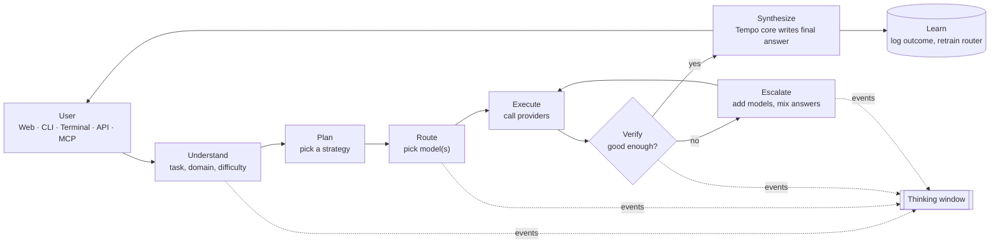
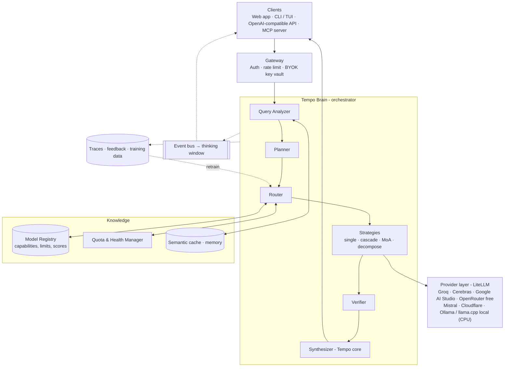
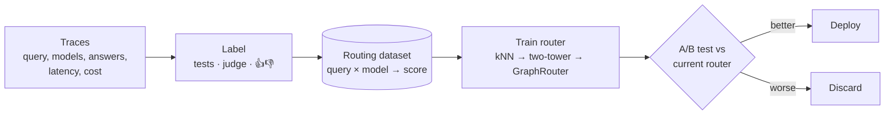
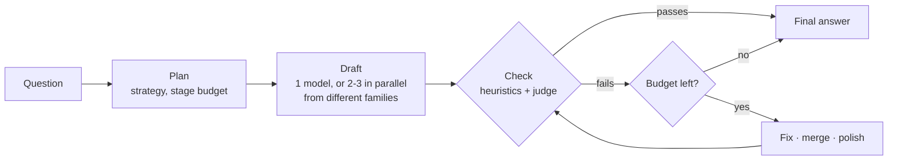
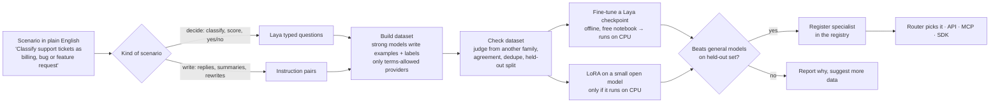

# Tempo architecture: a self-routing "model of models" platform

This is the detailed design for Tempo. It explains **what each part does, why it exists, and how the parts
talk to each other**. Code blocks are sketches to show the shape of the logic, not finished code.

Research behind these choices: [RESEARCH.md](./RESEARCH.md).

---

## 0. The idea in one picture



Every box emits events. The **thinking window** is just a live view of those events.

---

## 1. Design principles

1. **One brain, many hands.** Tempo has one orchestrator (the "brain") that owns every decision. Providers and models are interchangeable "hands".
2. **Cheap first, escalate on evidence.** Try the fastest suitable free model; bring in more models only when a verifier says the answer is weak.
3. **Everything is observable.** Each decision (why this model, how confident, what it cost) is an event the user can see and the learning loop can use.
4. **Free is a budget, not a guarantee.** Free tiers have per-minute and per-day limits. Tempo tracks remaining quota and routes around exhausted providers before a request fails.
5. **Speak standard protocols.** Tempo is itself an OpenAI-compatible model (`tempo/auto`) and an MCP server, so anyone can plug it into their own tools.
6. **Start simple, learn later.** Version 1 uses rules and embeddings. Logged outcomes train neural routers in later versions.
7. **Software only.** Tempo must be 100% software. Nothing may need a GPU or any special hardware to run: everything works on an ordinary CPU computer or a free cloud service. Free cloud notebooks (such as Kaggle's) are allowed only for **offline training jobs**, whose results Tempo then runs on CPU; nothing that serves a request may depend on them.

### 1.1 What the software-only rule means in practice

This rule applies to everything from now on. When a design choice would need a GPU, Tempo picks the CPU route below instead, or leaves the feature out.

| Needs special hardware (not allowed at run time) | What Tempo does instead |
|---|---|
| GPU inference for small models (Laya, classifiers) | CPU inference: Laya in PyTorch fp32 with shadow predictions in the background and a time limit measured on the machine (§4.12, [LAYA_CPU.md](./LAYA_CPU.md)); embeddings with fastembed (ONNX) |
| A GPU server for self-hosted LLMs (vLLM) | Small quantized models on CPU through Ollama or llama.cpp; hosted free APIs for anything bigger |
| Docker, gVisor or a VM to run untrusted code | A WebAssembly sandbox (wasmtime + a WASI build of CPython), a plain Python package (Phase 3) |
| Multi-LoRA serving on a GPU | Writing specialists only when they are small enough for CPU; llama.cpp applies LoRA adapters on CPU (Phase 5) |
| Training on a GPU | Offline jobs on free notebooks (Kaggle: 2×T4, about 30 GPU hours a week), exported to CPU formats before Tempo uses them |

"Small enough for CPU" is measured, not assumed: a model qualifies if it answers at a usable speed (roughly 10 tokens per second or more) on a 4-core CPU with 8 GB of RAM, which in practice means about 1–4B parameters at 4-bit quantization.

---

## 2. System overview



| Layer | Responsibility | Build or reuse |
|---|---|---|
| Clients | Web home page, CLI, terminal UI, API, MCP | Build (API is OpenAI-compatible, so Open WebUI / LibreChat work as a day-one UI too) |
| Gateway | Accounts, Tempo API keys, per-user limits, encrypted storage of users' provider keys | Build (small) |
| Brain | Understand → plan → route → execute → verify → synthesize | **Build: this is the product** |
| Registry + Quota | What models exist, what they're good at, how much free quota is left, are they up | Build, seeded from provider `/models` endpoints |
| Provider layer | Talk to 100+ providers in one format, retries, fallbacks | **Reuse [LiteLLM](https://github.com/BerriAI/litellm)** |
| Learning | Store traces, label outcomes, train routers | Build, using [LLMRouter](https://github.com/ulab-uiuc/LLMRouter) algorithms |

---

## 3. The life of one request

Example: a user types **"Write a Python function that parses ISO-8601 durations, with tests."**

| # | Step | What happens | What the thinking window shows |
|---|---|---|---|
| 1 | **Receive** | Gateway authenticates, loads user settings (mode, privacy, their own keys). | `Received · mode: auto` |
| 2 | **Cache check** | Embed the query; if a near-identical query was answered recently, return it. | `Cache miss` |
| 3 | **Understand** | Query Analyzer labels it: task=`code`, language=`python`, complexity=0.62, needs=`reasoning`, est. 900 output tokens, modality=`text`. | `Understanding: coding · Python · medium difficulty` |
| 4 | **Plan** | Planner picks a strategy. Medium code task → **cascade** with a code-execution verifier. | `Plan: cascade, verify by running tests` |
| 5 | **Route** | Router scores every available model for this query, drops ones with no quota or too-small context, picks the best. | `Routing → groq/llama-3.3-70b (score 0.81, 912 requests left today)` |
| 6 | **Execute** | Call through LiteLLM with streaming. If the provider errors or rate-limits, fall back to the next-best model automatically. | `Answer received in 1.6 s` |
| 7 | **Verify** | Extract code, run the tests in a sandbox. 2 of 5 fail → confidence 0.40. | `Verifier: 2/5 tests failed · confidence 0.40` |
| 8 | **Escalate** | Below threshold → Mixture-of-Agents: 3 strong free models get the question **plus** the failing attempt and test output. | `Escalating → 3 models in parallel` |
| 9 | **Aggregate** | Tempo core reads all candidates, merges the best parts, re-runs the tests: 5/5 pass. | `Aggregating · 5/5 tests pass · confidence 0.93` |
| 10 | **Synthesize** | Tempo core writes the final answer in one consistent voice and format. | `Writing final answer` |
| 11 | **Learn** | Store the trace: query embedding, models tried, scores, cost, latency, and later the user's 👍/👎. | (hidden) |

---

## 4. Components in depth

### 4.1 Query Analyzer ("where should this go?")

Goal: turn free text into a structured **query profile** in under ~100 ms.

```python
class QueryProfile(BaseModel):
    task: Literal["chat", "code", "math", "reasoning", "writing", "summarize",
                  "translate", "extract", "vision", "speech", "search"]
    domain: str | None           # "medicine", "law", "finance", ...
    complexity: float            # 0..1
    language: str                # "en", "hi", "gu", ...
    modality_in: set[str]        # {"text"}, {"text","image"}, {"audio"}
    needs: set[str]              # {"reasoning","tools","web","long_context","json"}
    est_input_tokens: int
    est_output_tokens: int
    embedding: list[float]
```

Build it in three layers, cheapest first:

1. **Rules** (microseconds): attachments → modality; code fences → code; "translate to" → translate; token count → long_context.
2. **Embedding classifier** (milliseconds): embed the query with a small local embedding model, compare with labelled example queries per task ([semantic-router](https://github.com/aurelio-labs/semantic-router) does exactly this).
3. **Small router LLM** (when unsure): [Arch-Router-1.5B](https://huggingface.co/katanemo/Arch-Router-1.5B) matches the query to route descriptions you write in plain English, or NVIDIA's [prompt-task-and-complexity-classifier](https://github.com/NVIDIA-AI-Blueprints/llm-router) returns task + complexity. Both run locally.

**As built (Phase 2):** layers 1 and 2. The embedding classifier (`tempo/embeddings.py`) embeds the question with [fastembed](https://github.com/qdrant/fastembed) (`BAAI/bge-small-en-v1.5`, ONNX, CPU) and takes a kNN vote over 12 labelled examples per task (`tempo/data/task_examples.yaml`). It overrides the keyword rules only when the vote is clear (similarity ≥ 0.55 and ≥ 50% of the votes) and the rules were not confident. Without the `embeddings` extra, the rules run alone. Laya (§4.12) also predicts the task type, in shadow mode by default.

### 4.2 Model Registry ("who can do what?")

A database row per model. It's what makes "1000+ models" manageable.

```yaml
id: groq/llama-3.3-70b-versatile
provider: groq
family: llama-3.3
params_b: 70
context_window: 131072
modalities_in: [text]
modalities_out: [text]
supports: [tools, json_mode, streaming]
free_limits: {rpm: 30, rpd: 1000, tpm: 12000}
privacy: {trains_on_data: unknown, allowed_for_end_users: check_terms}
skills:            # 0..1, from benchmarks + your own evals + live feedback
  code: 0.74
  math: 0.68
  reasoning: 0.70
  writing: 0.77
  multilingual: 0.71
elo: 1238          # updated from pairwise judge results
latency_p50_ms: 900
tokens_per_sec: 280
status: healthy    # from health checks
```

How it stays current:
- **Auto-sync** every few hours from provider model lists (OpenRouter `/api/v1/models`, Groq/Cerebras/Mistral `/v1/models`, Ollama `/api/tags`, Hugging Face Inference Providers). New models appear automatically with default skill scores taken from their family and size.
- **Probe evals**: when a new model appears, run a small fixed eval set (e.g. 50 questions per skill) in the background to fill in `skills`.
- **Live stats**: latency, error rate and user feedback update the row continuously.

**As built (Phase 2):** `tempo/models.yaml` is the seed list. `tempo/sync.py` reads each configured provider's model list every 6 hours (`TEMPO_SYNC_INTERVAL`) and on `tempo sync`. Listing models uses no generation quota, so it doubles as the health and key check. New chat models get priors guessed from size and family, and seeds that a provider stopped listing are marked "no longer offered" and skipped. For OpenRouter, the guess uses the provider's own fields where it has them: `supported_parameters` says whether a model reasons, `hugging_face_id` gives the size and family when the id does not, an unknown family falls back to the organisation (so the judge's different-family rule stays meaningful), and models past their `expiration_date` are not added. OpenRouter's model list is public, so `tempo sync` refreshes its free list even without a key. `tempo eval` runs a fixed probe set (`tempo/data/evalset.yaml`, 5 questions per task, graded by rules: number, contains, JSON, Python parses). `SkillBook` (`tempo/evals.py`) blends the measured scores with the priors, then adds live judge scores and live latency from the log. Each provider also records `training_on_outputs` (`yes`, `no` or `unclear`) with the link to its terms, the exact sentences the verdict rests on, and the date they were checked (`tempo terms` prints them). Dataset exports and Tempo Tune (§13) use it to decide whose outputs may become training data. As checked on 2026-09-28: Google AI Studio is `no` (its terms forbid developing models that compete with the Gemini API); Groq, Cerebras and OpenRouter are `unclear` (none forbids training outright, but each forbids building a competing service, and each model's own licence applies); local Ollama models depend on each model's licence.

### 4.3 Quota & Health Manager ("who can take a request right now?")

Free tiers fail in predictable ways: 429 rate limits, daily caps, model removed. Handle them **before** calling.

- A **token bucket per (provider, key, model)** in Redis for requests/min, requests/day, tokens/min. Read limits from the registry, then correct them from `x-ratelimit-*` response headers where the provider sends them.
- A **circuit breaker** per model: after N consecutive errors, mark it `degraded` for a cool-down period so the router skips it.
- **BYOK**: if a user has added their own Groq key, their requests use their bucket, not a shared one.

The router only ever sees models where `status == healthy and quota_left > 0`.

**As built (Phase 2):** `tempo/quota.py` keeps sliding one-minute and per-day counters per (provider, key, model), each day counted in the provider's own reset time zone (`day_reset_tz`; Google AI Studio resets at midnight Pacific), plus provider-wide pools where one exists (OpenRouter's `:free` models share 20/min and 50/day). Instead of Redis, the counters live in the process and daily totals are saved in SQLite, so they survive restarts. `x-ratelimit-*` headers (read through LiteLLM's hidden response headers, including on errors) correct the counters. The router skips models with no quota left and says why ("free requests used up for today"). A user's own key gets its own counters (`user:<id>`), separate from the server's key. Scarcity (few requests left today) lowers a model's score, so scarce strong models are saved for hard questions. A `quota_reserve` option keeps a share of each daily limit untouched; `tempo collect` uses it to leave half of every free allowance for real users. Providers also say whether their free allowance renews (`free_tier: free`) or is one-off credit (`trial`: Cerebras, since 2026), and `tempo models` and the web page show it.

### 4.4 Router ("pick the best model for this query")

**Hard filters** first (cheap, never wrong):
- modality supported, context window ≥ input + output tokens,
- quota available, healthy,
- privacy rule satisfied (e.g. user chose "local only" → only local Ollama / llama.cpp models).

**Then score** each remaining model:

```
utility(m, q) = w_quality · predicted_quality(m, q)
              − w_cost    · cost(m, q)          # 0 for free tiers, but counts quota scarcity
              − w_latency · expected_latency(m, q)
```

The user's **mode** sets the weights:

| Mode | w_quality | w_cost | w_latency |
|---|---|---|---|
| `fast` | 0.5 | 0.1 | 0.4 |
| `balanced` (default) | 0.7 | 0.15 | 0.15 |
| `best` | 0.95 | 0 | 0.05 |
| `private` | same as balanced, but local models only | | |

For free tiers, make `cost` reflect **scarcity**: a model with 3 requests left today "costs" more than one with 10,000 left. That spreads load and saves scarce strong models for hard queries.

`predicted_quality` is where the router gets smarter over time:

| Generation | How `predicted_quality` is computed | Needs |
|---|---|---|
| **G1: rules** | `registry.skills[q.task]` adjusted by complexity. | Nothing. Ship this first. |
| **G2: kNN** | Find the 20 most similar past queries (by embedding); average each model's judged score on them. | A few thousand logged, scored requests. |
| **G3: neural two-tower / matrix factorization** | A small network scores (query, model) pairs (sketch in §5). Same idea as RouteLLM's `mf` router. | ~10k+ scored requests. |
| **G4: graph router** | [GraphRouter](https://github.com/ulab-uiuc/GraphRouter): a GNN over task, query and model nodes predicts quality and cost for each query→model edge; new models join without retraining. | Mature dataset. |
| **G5: LLM orchestrator trained with RL** | [Router-R1](https://github.com/ulab-uiuc/Router-R1): Tempo core itself decides "think" vs "call model X" step by step, trained with a reward for correctness minus cost. | Research-grade; later. |

### 4.5 Strategies ("how many models, and how do they work together?")

The Planner chooses one strategy per request:

| Strategy | When | How |
|---|---|---|
| **Single** | Easy or chatty queries (complexity < 0.3) | One model, fallback on error. |
| **Cascade** | Most queries | Cheap/fast model first; verify; escalate one tier at a time. ([FrugalGPT](https://arxiv.org/abs/2305.05176), [AutoMix](https://github.com/automix-llm/automix)) |
| **Mixture-of-Agents** | Hard queries, `best` mode, or after a failed cascade | K proposer models in parallel, optional 2nd layer that sees layer-1 answers, then an aggregator. ([MoA](https://github.com/togethercomputer/MoA)) |
| **Decompose** | Multi-part or multi-modal tasks ("transcribe this audio, summarize it, translate to Hindi") | Split into sub-tasks, route each to a specialist (Whisper for speech, a vision model for images, an LLM for text), then combine. ([HuggingGPT](https://github.com/microsoft/JARVIS)) |
| **Tool-augmented** | Needs fresh facts or computation | Give the model tools: web search, code sandbox, calculator; or route to a provider with built-in tools. |

Cascade sketch:

```python
async def cascade(q: QueryProfile, messages, trace) -> Answer:
    attempts = []
    for tier in planner.ladder(q):                 # e.g. [fast_small, strong_free, mixture]
        model = router.best(q, tier=tier, exclude=[a.model for a in attempts])
        trace.emit("route", model=model.id, score=model.score, why=model.reason)

        answer = await providers.call(model, messages, on_error=router.fallback)
        verdict = await verifier.check(q, messages, answer)
        trace.emit("verify", model=model.id, confidence=verdict.confidence, notes=verdict.notes)

        if verdict.confidence >= q.min_confidence:
            return answer
        attempts.append(answer.with_feedback(verdict))   # the next tier sees what went wrong

    return await mixture_of_agents(q, messages, seed_answers=attempts, trace=trace)
```

Mixture-of-Agents sketch (this is the "layers" part of the idea):

```python
async def mixture_of_agents(q, messages, seed_answers, trace, layers=2, k=3):
    references = [a.text for a in seed_answers]
    for layer in range(layers):
        proposers = router.top_k(q, k=k, diverse_families=True)
        trace.emit("layer", n=layer + 1, models=[m.id for m in proposers])
        results = await asyncio.gather(
            *(providers.call(m, with_references(messages, references)) for m in proposers),
            return_exceptions=True,
        )
        references = [r.text for r in results if not isinstance(r, Exception)]

    aggregator = router.best(q, role="aggregator")    # usually Tempo core
    trace.emit("aggregate", model=aggregator.id, inputs=len(references))
    return await providers.call(aggregator, aggregate_prompt(messages, references))
```

Pick proposers from **different model families** (Llama, Qwen, Gemma, Mistral, gpt-oss). Diversity is what makes mixing help; three copies of similar models mostly repeat each other.

### 4.6 Verifier ("is this model capable, or do we need help?")

This is how Tempo decides "the model is not capable". Combine cheap signals first:

| Signal | Cost | Catches |
|---|---|---|
| Provider error, timeout, empty or cut-off output | free | outages, context overflow |
| Refusal detection (regex + small classifier) | free | "I can't help with that" on a harmless request |
| Format checks (valid JSON / schema, code parses) | free | broken structured output |
| **Execution** (run code and tests in a sandbox, check math numerically) | cheap | wrong code / wrong numbers; strongest signal when available |
| Self-verification: ask the same small model "is this answer correct?" (AutoMix-style) | 1 small call | many reasoning slips |
| LLM-as-judge with a different model family, scored 1–10 against a rubric | 1 call | quality, completeness |
| Agreement: do 2–3 models give the same final answer? | K calls | factual / math questions |

Output: `confidence ∈ [0,1]` plus short notes. The threshold depends on mode (`fast` accepts 0.6, `best` wants 0.85).

**As built (Phase 2):** `tempo/checks.py` runs free heuristics first: empty answer, cut off at the length limit, unclosed code fence, refusal, invalid JSON when JSON was asked for, Python that does not parse, no code block for a code task, very short answer, wrong script for the question's language (it weighs as two soft issues outside code tasks, so a wrong-language answer fails `auto` without a judge and gets rewritten), and repetition. Then a **judge** model from a different family than the writer scores the answer 1–10 and lists issues, and the two are combined into one score. The pass marks are fast 0.6, auto and private 0.7, best 0.85. Without a judge, the score is capped at 0.8 of the heuristic score. Hard failures (empty, cut off, refusal, broken code) can never pass. Code is only **parsed, not run**: sandboxed execution is still to do.

### 4.7 Synthesizer / Tempo core ("goes back to my main model")

Tempo core is **your own** model identity: a system prompt, output style and a model you control.

- **Version 1:** a strong free model chosen by the router for the `aggregator` role, with Tempo's system prompt.
- **Version 2:** a self-hosted open-weight model small enough to run on CPU (for example a 1–4B Qwen or Gemma, 4-bit quantized, through Ollama or llama.cpp), so Tempo always has a brain even when every free API is exhausted. Under the software-only rule (§1), a GPU server such as vLLM is not an option.
- **Version 3:** fine-tune that model (LoRA) on your own traces in an offline job on a free notebook, then run the result on CPU, so it gets better at routing decisions and at merging other models' answers. Check each provider's terms before training on its outputs; many forbid using outputs to build competing models. Outputs of permissively licensed open-weight models you run yourself are the safest training data.

Its jobs: merge candidate answers, fix contradictions, keep one voice and format, cite which model contributed what (optional), and treat all sub-model output as **untrusted text** (never follow instructions found inside it).

### 4.8 Event bus and the thinking window

Every Brain step publishes a small JSON event to the request's channel (Redis pub/sub or an in-process queue). Clients subscribe with **Server-Sent Events** (web) or read the stream (CLI).

```json
{"t": 0.00, "type": "received",  "mode": "auto"}
{"t": 0.04, "type": "analyze",   "task": "code", "lang": "python", "complexity": 0.62}
{"t": 0.05, "type": "plan",      "strategy": "cascade", "verify": "run_tests"}
{"t": 0.06, "type": "route",     "model": "groq/llama-3.3-70b-versatile", "score": 0.81,
                                 "why": "top code score among healthy models; 912 req left today"}
{"t": 1.66, "type": "call_end",  "model": "groq/llama-3.3-70b-versatile", "ms": 1600, "tokens": 734}
{"t": 2.10, "type": "verify",    "confidence": 0.40, "notes": "2/5 tests failed"}
{"t": 2.11, "type": "escalate",  "strategy": "mixture", "models": ["cerebras/gpt-oss-120b", "gemini/gemini-flash", "mistral/mistral-small"]}
{"t": 6.80, "type": "aggregate", "model": "tempo-core", "inputs": 3}
{"t": 7.30, "type": "verify",    "confidence": 0.93, "notes": "5/5 tests pass"}
{"t": 7.31, "type": "answer_delta", "text": "Here is a parser..."}
{"t": 9.02, "type": "done",      "models_used": 5, "total_ms": 9020, "cost_usd": 0}
```

UI rules for the window: small panel, monospace, auto-scrolls, collapsible, each line expandable to see detail (full scores table, raw candidate answers). Show **decisions** (what Tempo did and why), not raw hidden reasoning. If a model returns visible reasoning (some open reasoning models do), show it as an expandable sub-item.

### 4.9 Cache and memory

- **Semantic cache**: embedding + pgvector/Redis; return a cached answer when similarity > 0.97 and the query isn't time-sensitive. Saves scarce free quota.
- **Conversation memory**: recent turns verbatim, older turns summarized by a small model. The router has to account for the history's tokens when checking context windows.
- **Sticky routing inside a conversation**: prefer the same model across turns unless the task changes, so tone and context stay consistent.

**As built (Phase 2):** the semantic cache (`SemanticCache` in `tempo/embeddings.py`) reuses the classifier's embeddings. A hit needs cosine similarity ≥ 0.97, the same user and mode, a checked answer that passed, and an age under 24 hours (`TEMPO_CACHE_TTL`). Questions that depend on the current time ("today", "latest", "price", …) are never cached. The cache is in memory, so it is empty after a restart. Conversation memory and sticky routing are not built yet.

### 4.10 Learning loop



- Log every request (with user consent and PII scrubbing).
- Label outcomes automatically (tests, judge scores) and with users' 👍/👎.
- Occasionally (e.g. 2% of traffic) send the query to a **second** model too and have a judge compare them. This "exploration" data is what teaches the router about models it rarely picks.
- Retrain nightly or weekly; deploy only if it beats the current router offline **and** in an A/B test.

**As built (Phase 2):** logging and labelling are done; router training is Phase 3. For every question, `tempo/store.py` (SQLite in `~/.tempo/tempo.db`, `TEMPO_DATA_DIR`) records the question, its profile, every decision (rules value, Laya's prediction, probabilities, latency, status, who decided), every stage (job, models, reason, time, quota), every call (model, attempt, time, tokens, output, error, judge score), the check results, the final answer, the stop reason, and 👍/👎 from the web page. `TEMPO_LOG=0` turns it off. `tempo export-laya` turns the log into a fine-tuning dataset for Laya (§4.12), and `tempo laya compare` measures Laya against the rules on held-out questions.

### 4.11 The staged engine (built in Phase 2)

Every question runs as a series of **stages**. Each stage has one job, and a stage can call several models in parallel. `tempo/pipeline.py` runs it; strategies (§4.5) only change which stages run.



| Job | What it does |
|---|---|
| **draft** | Writes a first answer. `single`/`cascade`: one model. `mixture`: 2–3 models from different families in parallel (`TEMPO_MAX_PARALLEL`). `decompose`: one model per part, several parts per stage, then a `combine` step. |
| **check** | Runs the heuristics, then a judge from another family (§4.6). With parallel drafts, it judges every draft. |
| **fix** | Another model (not the one that wrote the failing answer) rewrites the best answer using the check's issue list. |
| **merge** | Merges the best parts of parallel drafts into one answer. |
| **polish** | A last rewrite when only one stage is left and the answer still hasn't passed. |

In a cascade, the order is draft → check → fix → check. If the fix still fails and at least 3 stages are left, the cascade escalates: 2–3 new drafts from model families not used yet, then merge → check. The `pick` decision (§4.12) chooses the model for every stage from a ranked shortlist.

**When it stops.** The engine stops **as soon as an answer passes its check**, or when the stop decision says to send the answer (made by the rules, or by Laya once it has taken over). It also stops when a budget runs out, and then sends the best answer so far. A hard failure never stops early. Every question has three budgets. Server defaults come from environment variables; one question can change them from a CLI flag, the web settings panel, or the API's `tempo` field.

| Budget | Default | Limit | Stop reason |
|---|---|---|---|
| `max_stages` | 5 (`TEMPO_MAX_STAGES`) | 50 (use 20+ for long multi-part jobs) | `budget_stages` |
| `time_budget_s` | 60 s (`TEMPO_TIME_BUDGET`) | 600 s | `budget_time` |
| `quota_budget` | 12 free provider requests (`TEMPO_QUOTA_BUDGET`) | 200 | `budget_quota` |

Local models cost no quota. The other stop reasons are `passed`, `decided`, `polished` (the last stage was a polish, with no stage left to check it), `unchecked` (the stage budget ended before the newest answer could be checked, for example with `max_stages` 1) and `cache`.

**Live replacement.** The first draft streams to the user right away. When a later stage produces a better answer, the engine sends `answer_reset` and streams the replacement. `answer_final` always carries the answer that was chosen. OpenAI clients cannot take back text, so with more than one stage `/v1/chat/completions` streams the checked final answer. It streams live only when `max_stages` is 1.

**Thinking-window events per stage** (the web app, CLI and API all render the same stream):

| Event | Fields |
|---|---|
| `plan` | strategy, max_stages, drafts, parts, time and quota budgets, reason, Laya status |
| `stage_start` | stage number, max stages, **job**, **models**, **reason**, requests left, time left |
| `call_start` / `call_end` / `call_error` / `fallback` | stage, model, attempt, ms, first-token ms, tokens |
| `answer_delta` / `reasoning_delta` / `answer_reset` | stage, model, text |
| `check` | per-answer score, pass/fail, issues, judge model |
| `decision` | name, value used, rules value, Laya value and probability, Laya status and ms, who decided |
| `stage_end` | stage, job, **time taken**, requests used and left, time left, **quota left today** per model |
| `budget` | which budget ran out |
| `answer_final`, `done` | answer, model, stage, score; totals and stop reason |

### 4.12 Laya: the fast decision-maker (built in Phase 2, shadow mode)

[Laya](https://github.com/NandhaKishorM/laya) (`convaiinnovations/laya`, Apache-2.0, `pip install laya`) does not write text. It answers **typed questions** about a text (choice, score, yes/no) with calibrated probabilities, in one forward pass (about 35 ms on a T4 GPU). Tempo asks it three groups of questions (`tempo/laya_decider.py`):

| When | Group | Decisions | Type |
|---|---|---|---|
| Before stage 1 | `plan` | `task_type` (8 tasks), `difficulty` (4 levels), `strategy` (single/cascade/mixture/decompose), `stage_budget` (2/3/5/8+) | choice, score |
| After each check | `assess` | `quality` (5 levels), `should_stop` (send now / keep improving) | score, two-option choice |
| Before a stage | `pick` | `next_model` from a shortlist of **at most 10** ranked candidates (Laya gets weak with many options) | choice |

- **Short context.** The English checkpoint reads 512 tokens (about 320 for the state), so Tempo sends the question (first 700 characters) and a trimmed answer (the first 500 and last 150 characters), not the whole conversation.
- **In-process, optional, CPU only.** `pip install -e ".[laya]"` (Laya with ONNX Runtime). Tempo loads one checkpoint on a single worker thread with up to 4 CPU threads (`tempo/laya_runtime.py`): PyTorch fp32 by default, or ONNX Runtime fp32 or INT8 (`TEMPO_LAYA_BACKEND`). INT8 is twice as fast on short inputs but changes answers; on a fine-tuned checkpoint it cost 8 accuracy points, so it is off by default. An ONNX file is exported from the checkpoint once and cached. `laya-serve` is not used, because its default port 8000 is Tempo's own. `TEMPO_LAYA=auto` loads Laya when it is installed, `on` also loads it for one-shot CLI runs, and `off` disables it. Measurements and the choice of default: [LAYA_CPU.md](./LAYA_CPU.md).
- **Shadow mode first.** Base checkpoints are near-random on new typed decisions until fine-tuned. By default Laya predicts, the rules decide, and both are logged. `TEMPO_LAYA_TAKEOVER` sets each decision's mode: `shadow`, `laya`, or `auto`. `auto` hands a decision to Laya only once `tempo laya compare` shows it beating the rules on at least 50 held-out rows. Example: `TEMPO_LAYA_TAKEOVER="should_stop=auto, next_model=auto"`. Even after a takeover, Laya's answer is used only if its confidence is at least `TEMPO_LAYA_MIN_CONFIDENCE` (0.6).
- **No waiting in shadow mode, measured limit after takeover.** A shadow prediction's answer is not used, so Tempo asks Laya in the background and logs the prediction when it finishes; shadow mode adds no time to an answer. Only decisions Laya has taken over are waited for, and only their questions are asked on the critical path (one row instead of the whole group); those calls jump ahead of background ones. The time limit is measured when Laya loads: 1.5× the slowest of a plan, an assess and a pick call on this machine (100 ms to 5 s; `TEMPO_LAYA_TIMEOUT_MS` fixes it by hand). If Laya is missing, fails to load, errors, is busy or runs past the limit, the rules decide and the reason is logged (`missing`, `error`, `busy`, `timeout`). A prediction that ran past the limit keeps running and is logged as `late`, so the logs stay complete on slow hardware.
- **Tuning loop.** `tempo export-laya` writes `train.jsonl` / `test.jsonl` in the typed-decisions format that Laya's official notebook (`notebooks/laya_finetune_typed_decisions_2xT4_kaggle.ipynb`) loads with `load_dataset("json", …)`. The columns are `id`, `workflow`, `split`, `state`, `questions`, `gold`, `factors`, `label_agreement` and `n_questions`. Most labels come from **outcomes**, not from the rules. `task_type` comes from the analyzer (keyword rules plus embeddings). `difficulty`, `strategy` and `stage_budget` come from how many stages the answer really needed. `quality` comes from the judge, adjusted by 👍/👎. `should_stop` is whether later stages actually improved the answer. `next_model` comes from judged comparisons on the same stage, or from hindsight. Only rows whose text comes from providers marked `training_on_outputs: yes` are exported by default. `--include-unclear` adds `unclear` providers once you have read their terms, and `no` is never exported. The notebook's own preprocessing was run on an export and built every item, with the longest sequence at 182 of 512 tokens. After fine-tuning, set `TEMPO_LAYA_MODEL` to the new checkpoint (a local folder or Hub repo). It then answers every decision and is the only checkpoint loaded. Collect a few hundred questions in shadow mode, run `tempo laya compare`, and set the decisions that win to `auto`. Each prediction is logged with its checkpoint, so the comparison and the `auto` switch only count predictions from the checkpoint that is loaded now.

---

## 5. The "neural network that connects models": what is and isn't possible

Your idea: when one model isn't enough, "connect both using a neural network and layers". Here's how that maps to real engineering.

**Not possible with API models:** wiring the internal layers or hidden states of two hosted models together. An API gives you text (sometimes token probabilities), never the weights or activations.

**What you can do, and what Tempo does:**

1. **A neural network that decides the connections (the router).** A trained network looks at the query and predicts how well each model will do. This is the "structural neural network": it learns the structure of which models are good at what.
2. **Layers of models that pass answers forward (Mixture-of-Agents).** Layer 1 models answer, layer 2 models read those answers and improve them, an aggregator merges. That is a neural-network-like layered graph where each "neuron" is a whole LLM and the "signals" are text.
3. **A graph over models, tasks and queries (GraphRouter).** A graph neural network treats models as nodes and predicts which query→model edges will work well.
4. **With self-hosted open-weight models only:** offline **model merging** (e.g. [mergekit](https://github.com/arcee-ai/mergekit), which runs on CPU) to create one model from several of the same architecture, or LoRA adapters per skill swapped in at request time. Only for models small enough to run on CPU (§1.1). Useful later, not needed for v1.

A starter G3 router is small (two-tower design, same idea as RouteLLM's matrix factorization):

```python
import torch
import torch.nn as nn

class TwoTowerRouter(nn.Module):
    """Predicts P(model m answers query q well) for every model at once."""

    def __init__(self, query_dim=768, model_feat_dim=32, hidden=256, dim=64):
        super().__init__()
        self.query_tower = nn.Sequential(nn.Linear(query_dim, hidden), nn.ReLU(), nn.Linear(hidden, dim))
        self.model_tower = nn.Sequential(nn.Linear(model_feat_dim, hidden), nn.ReLU(), nn.Linear(hidden, dim))

    def forward(self, query_emb, model_feats):
        # query_emb: [batch, query_dim]; model_feats: [num_models, model_feat_dim]
        q = self.query_tower(query_emb)          # [batch, dim]
        m = self.model_tower(model_feats)        # [num_models, dim]
        return torch.sigmoid(q @ m.T)            # [batch, num_models]

# Train with BCE loss on labels = 1 if the judged score for (query, model) >= threshold.
```

The model tower takes **model features** (size, context, family, benchmark scores, registry skills) instead of a fixed model ID. That means a model added yesterday still gets a sensible prediction on day one, which matters when the free-model list changes every week.

---

## 6. Using Tempo as a skill or plug-in

"Anyone can attach Tempo to their work with some conditions" means exposing it through standard interfaces.

### 6.1 OpenAI-compatible API (works with almost every tool)

```python
from openai import OpenAI

client = OpenAI(base_url="https://your-tempo-host/v1", api_key="tempo_live_...")

resp = client.chat.completions.create(
    model="tempo/auto",                       # or tempo/fast, tempo/best, tempo/private
    messages=[{"role": "user", "content": "Summarize this contract clause..."}],
    stream=True,
    extra_body={
        "tempo": {                            # the "conditions"
            "max_latency_ms": 8000,
            "min_confidence": 0.8,
            "privacy": "no_training_providers",   # or "local_only"
            "allow_providers": ["groq", "cerebras", "ollama"],
            "strategy": "auto",               # or single / cascade / mixture
            "trace": True,                    # stream thinking-window events too
        }
    },
)
```

Because this is the OpenAI format, Tempo drops into LangChain, LlamaIndex, Open WebUI, LibreChat, Cursor-style editors, n8n and similar tools by changing only `base_url` and `model`.

### 6.2 MCP server (for AI agents and assistants)

```python
from mcp.server.fastmcp import FastMCP

mcp = FastMCP("tempo")

@mcp.tool()
async def ask_tempo(question: str, mode: str = "auto", privacy: str = "default") -> str:
    """Answer a question by routing it to the best available model(s)."""
    result = await brain.run(question, mode=mode, privacy=privacy)
    return result.text

@mcp.tool()
async def list_models(task: str | None = None) -> list[dict]:
    """List healthy models, optionally filtered by task, with remaining free quota."""
    return registry.available(task=task)

if __name__ == "__main__":
    mcp.run()
```

Any MCP client (Claude, IDE agents, other agent frameworks) can then call Tempo as a tool.

### 6.3 Other surfaces

| Surface | Use |
|---|---|
| **CLI** `tempo "question" --mode best --trace` | Scripts, terminals, CI pipelines |
| **Python / JS SDK** | Typed wrapper over the API with trace-event callbacks |
| **Agent skill file** (a `SKILL.md` that calls the CLI) | Coding agents that support skills |
| **A2A agent card** | Other agents delegate whole tasks to Tempo |
| **Webhooks** | Long jobs (decomposed multi-modal tasks) report back when done |

---

## 7. Product surfaces

### Web home page
- Hero prompt box (Enter to send, Shift+Enter for newline), attachment button, mode switch (Auto / Fast / Best / Private).
- Thinking window beside or under the answer; auto-scrolls; collapsible.
- **Model explorer**: live registry with status dots, remaining free quota, skill radar per model.
- **Compare view**: same prompt, 2–4 models side by side, with a vote button that feeds the learning loop.
- **Keys page (BYOK)**: add your own Groq / Google / OpenRouter / Mistral keys; see per-key quota.
- **Usage dashboard**: requests, models used, latency, escalation rate.
- **Developers page**: API keys for Tempo, copy-paste snippets (curl, Python, JS, MCP config).

### CLI and terminal
```
$ tempo "explain the CAP theorem with an example" --trace
▸ Understanding: explain · distributed systems · complexity 0.45
▸ Plan: single model, judge-verify
▸ Routing → cerebras/gpt-oss-120b (score 0.84 · fastest healthy strong model)
▸ Verifier: confidence 0.88 ✓
────────────────────────────────────────
The CAP theorem says ...
```
Built with Typer + Rich (Python): a `Live` panel for the trace above the streamed answer. `tempo chat` opens an interactive session; `tempo models`, `tempo keys add groq` manage settings.

---

## 8. Security, privacy and fair use

- **Key vault**: users' provider keys encrypted at rest (envelope encryption with a master key in a KMS or at least a secret outside the database). Never logged, never sent to the browser after saving.
- **Privacy routing**: every registry entry carries `trains_on_data` / `allowed_for_end_users`; the router enforces the user's privacy choice as a hard filter.
- **PII scrubbing** before logging traces and before sending to providers flagged as training on data.
- **Prompt-injection hygiene**: sub-model outputs are data. The aggregator prompt fences them and tells Tempo core to ignore instructions inside them.
- **Safety filter**: a moderation model (e.g. Llama Guard, available free on some providers) on input and output.
- **Fair use of free tiers**: respect each provider's limits and terms; no key pooling or rotation to evade limits; prefer BYOK for public deployments. Never use reverse-engineered "free GPT" endpoints.
- **Sandbox** for code-execution verification (Phase 3): a WebAssembly sandbox (wasmtime running a WASI build of CPython) with no network, a scratch folder only, and memory, time and output limits. It is a normal Python package, so it needs no Docker, gVisor or special machine (§1.1).

---

## 9. Tech stack

| Concern | Choice | Why |
|---|---|---|
| Language | Python 3.12 | The ML tooling (routers, embeddings, PyTorch, LiteLLM, MCP SDK) is Python-first |
| API server | FastAPI + Uvicorn, SSE for events | Async, streaming, typed |
| Provider calls | LiteLLM SDK (Router for fallbacks) | 100+ providers in one format |
| State | Redis | Quota buckets, circuit breakers, pub/sub for trace events, cache |
| Database | Postgres + pgvector | Registry, users, traces, feedback, embeddings |
| Local models | Ollama or llama.cpp on CPU (small 4-bit models), llama.cpp for Arch-Router GGUF | Always-available brain, private mode, no GPU (§1.1) |
| Embeddings | A small local embedding model (BGE / Qwen3-Embedding class) | Fast, free, private |
| Router training | PyTorch + LLMRouter algorithms, as offline jobs (a free notebook at most); served on CPU via ONNX | Proven implementations, software-only at run time |
| Observability | OpenTelemetry + Langfuse (open source LLM tracing) | See every call, cost, latency |
| Web | Next.js + Tailwind | Fast to build a polished UI |
| CLI | Typer + Rich | Nice terminal UX with live panels |
| Deploy | One `tempo serve` process on any CPU machine or free CPU host; containers optional, never required | Start small, software only |

---

## 10. Proposed repository layout

Phases 1 and 2 keep a flat `tempo/` package with one module per component (see the README): `pipeline.py` (staged engine), `checks.py`, `prompts.py`, `quota.py`, `laya_decider.py`, `embeddings.py`, `evals.py`, `sync.py`, `accounts.py`, `store.py` and `tuning.py` were added in Phase 2. The package will grow into this layout as the later phases land.

```
tempo-server/
├── tempo/
│   ├── api/            # FastAPI: /v1/chat/completions, /v1/models, /v1/traces/{id} (SSE)
│   ├── brain/
│   │   ├── analyzer.py     # QueryProfile
│   │   ├── planner.py      # strategy choice
│   │   ├── router.py       # filters + utility scoring (G1..G3)
│   │   ├── verifier.py     # confidence signals
│   │   └── synthesizer.py  # Tempo core prompts
│   ├── strategies/     # single.py, cascade.py, mixture.py, decompose.py
│   ├── registry/       # models table, provider sync jobs, probe evals
│   ├── quota/          # token buckets, circuit breakers
│   ├── providers/      # LiteLLM wrapper, BYOK key resolution
│   ├── events/         # trace event types + bus
│   ├── cache/          # semantic cache, memory
│   └── learn/          # dataset export, router training, A/B
├── cli/                # `tempo` command
├── mcp/                # MCP server
├── web/                # Next.js app
├── evals/              # fixed eval sets per skill
└── docs/
```

---

## 11. Roadmap

| Phase | Scope | Done when |
|---|---|---|
| **1. MVP** ✅ done | FastAPI + LiteLLM with 5 sources (Groq, Cerebras, Google AI Studio, OpenRouter free, Ollama with auto-discovery). Rule-based analyzer, G1 router, fallbacks with cool-downs, SSE trace, CLI, web app, OpenAI-compatible API. | You type a question in CLI or web, see which model was picked and why, the answer streams, and a provider failure falls back automatically. |
| **2. Smart** ✅ done | Staged engine (draft → check → fix → merge/polish, parallel models per stage, early stop, stage/time/quota budgets, live replacement). Quota manager, answer checker, cascade, mixture, decompose. Embedding classifier, semantic cache. Measured skill scores, registry auto-sync and health checks. BYOK key vault with users. Laya in shadow mode at every stage, full logging for tuning, Laya dataset export and comparison. Usage dashboard. | Hard questions escalate visibly to multiple models; no user-visible 429 errors under normal load. |
| **3. Learning** (4–6 weeks) | Consent and PII scrubbing for logs. Fine-tune Laya on the exported logs (offline, on a free notebook) and let it take over the decisions where it wins. kNN, then two-tower routers trained on judged outcomes (served on CPU). Exploration traffic, Arch-Router for user-defined routes, A/B framework. **Run code in a WebAssembly sandbox** in the checker: wasmtime (a pip package) runs a WASI build of CPython with no network, a scratch folder only, and memory, time (epoch interruption) and output limits, so answers' Python code and tests really run without Docker or any special machine. Standard-library Python first; JavaScript through a QuickJS WebAssembly build later. | Learned router beats G1 rules on your eval set at equal or lower quota use; generated code is executed and its tests counted in the check. |
| **4. Platform** (ongoing) | MCP server, SDKs, A2A card, skill file, decomposition for multimodal tasks (CPU-sized speech and vision models, e.g. whisper.cpp), a CPU-sized self-hosted Tempo core (§4.7), GraphRouter trained offline, LoRA fine-tune of Tempo core. Shared state (Redis) so several servers share quota counters and the cache. | External developers use Tempo as a model or tool in their own apps. |
| **5. Tempo Tune** (roadmap only, see §13) | A user describes a scenario in plain English. Tempo builds and checks a labelled dataset with stronger models, and trains in an offline job on a free notebook. **Laya decision models come first**, because they run on CPU (§4.12). Writing models (LoRA on a small open model) come only if the result is small enough to run on CPU (§1.1); several such adapters share one base model in llama.cpp. Tuned models are available through the API, MCP server and SDK. | A user goes from a one-paragraph scenario to a tuned specialist that beats the general models on that scenario's held-out set, without writing code or owning a GPU. |

---

## 12. What to measure

| Metric | Why |
|---|---|
| Answer quality (judge score, 👍 rate, test pass rate) | The point of routing |
| Router regret: quality of the chosen model vs the best model in hindsight (from exploration traffic) | Is the router picking well? |
| Escalation rate and escalation win rate | Are escalations frequent, and do they help? |
| p50 / p95 latency, time to first token | Users feel this first |
| Fallback rate, 429 rate, quota exhaustion events per provider | Health of the free-tier strategy |
| Cost per answer (for paid/BYOK keys) and free quota used per answer | Sustainability |

---

## 13. Tempo Tune (roadmap only, not built yet)

Tempo Tune turns a plain-English description into a small tuned model that Tempo can route to. It builds on the Phase 2 logging and Laya export, and it depends on the Phase 4 MCP server and SDK to reach other users. It follows the software-only rule (§1): training runs offline (a free notebook at most), and every tuned model must run on CPU. So it **starts with Laya decision models**, and adds writing models only when they are small enough for CPU.



**1. Describe the scenario.** The user writes a paragraph, for example "Classify incoming support tickets as billing, bug or feature request" or "Reply to customer reviews in our brand voice", with optional example inputs and a few labelled examples. Tempo turns it into a spec: the kind of scenario (**decision** or **writing**), the labels or output format, what counts as correct, and 5–10 seed examples for the user to confirm.

**2. Build a labelled dataset with stronger models.** The staged engine in `best` mode generates varied inputs from the seeds (different lengths, tones, edge cases, languages), then labels or answers each one.
- Every item goes through the checker. Labels need two models from different families to agree, or a judge to confirm. Near-duplicates are removed (by embedding), the labels are balanced, and a held-out test split is kept aside before any training.
- **Terms of use come first.** Training data is generated only with models whose provider is marked `training_on_outputs: yes` in the registry (§4.2), and whose model licence also allows it. Each dataset records which provider and model produced every item and under which recorded terms, so a dataset can be rebuilt without a provider if its terms change. Local open-weight models with permissive licences are the default generators. `unclear` providers are never used for Tempo Tune, even though `tempo export-laya --include-unclear` can include them.

**3. Fine-tune.**
- **Decision scenarios come first** (classify, score, yes/no). They become Laya typed questions (`choice`, `score`, `noul`) and are trained with the same notebook format that `tempo export-laya` already produces. The result runs on CPU exactly like Tempo's own Laya (§4.12), returning calibrated probabilities. It stays in full precision: INT8 cost a fine-tuned checkpoint 8 accuracy points ([LAYA_CPU.md](./LAYA_CPU.md)).
- **Writing scenarios come later, and only if they fit on CPU.** They get a LoRA adapter on a small open model whose licence allows fine-tuning (for example a 1–4B Qwen or Gemma), trained with a standard SFT recipe (PEFT or Unsloth) on instruction pairs. The result is converted to GGUF with 4-bit weights. If it does not reach usable speed on a 4-core CPU (§1.1), it is not registered, and the scenario stays with the general models.
- Training runs as an offline job on a free notebook, such as the Kaggle 2×T4 one Laya's notebook targets (the software-only rule allows notebooks only for offline training). Nothing about serving depends on the notebook. Tempo stores the adapter or checkpoint, the dataset version and the evaluation results together.

**4. Evaluate and register.** The tuned model is compared on the held-out split against the general models the router would otherwise pick. It is registered only if it wins, or ties at a lower cost or latency. A registered specialist becomes a registry row with `kind: specialist`, the scenario's description and its embedding, its measured score, its owner, and who may use it (private, a team, or public). The analyzer matches new questions against scenario descriptions (the same way it matches task examples), so the router can choose the specialist and fall back to general models when it is unavailable or unsure.

**5. Serve many specialists cheaply, on CPU.** Laya specialists are checkpoints of about 0.8 GB that load in a few seconds on CPU; the most used stay in memory and the rest load on demand. Only questions whose decisions a specialist has taken over are waited for, as in §4.12. Writing specialists built on the same base model share **one** copy of the base weights: llama.cpp's server loads several LoRA adapters next to one GGUF base and picks them per request (its `lora` request field), all on CPU. Requests for different adapters are not batched together, so writing specialists suit light traffic; rarely used adapters are unloaded when idle.

**6. Use it anywhere.** Specialists appear in `/v1/models` and can be called by id (for example `tune/<owner>/<name>`) through the OpenAI-compatible API, as MCP tools (one tool per specialist, with the scenario description as the tool description), and through the SDK. The owner's settings decide who else may use them, and usage counts toward the owner's quota.
